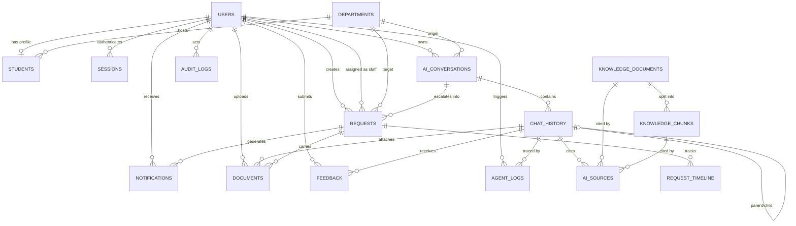

* [ ] 

# DATABASE_DESIGN.md

**Agentic AI-Based University Workflow Automation System**
Multi-Agent Student Support Platform — developed for **Sindh Madressatul Islam University (SMIU)**

> Version: 1.0 · Status: Approved Architecture · Last Updated: August 2026 · Owner: Final Year Project Team
> Scope: Single source of truth for the complete database architecture — design principles, schema, tables, columns, keys, indexes, constraints, relationships, migration strategy, backup strategy, security, performance, and future expansion.
> Sufficiently detailed that the entire database layer (SQLAlchemy 2.0 models, Alembic migrations, and seed data) can be generated without additional database instructions.
> This document is **architecture and documentation only** — it contains no SQL, no ORM model code, and no migration code.

---

## Table of Contents

1. [Database Design Principles](#1-database-design-principles)
2. [ER Diagram Description](#2-er-diagram-description)
3. [Naming Conventions](#3-naming-conventions)
4. [Database Schema](#4-database-schema)
5. [All Tables](#5-all-tables)
6. [Columns](#6-columns)
7. [Primary Keys](#7-primary-keys)
8. [Foreign Keys](#8-foreign-keys)
9. [Indexes](#9-indexes)
10. [Constraints](#10-constraints)
11. [Relationships](#11-relationships)
12. [User Table](#12-user-table)
13. [Student Profile](#13-student-profile)
14. [Departments](#14-departments)
15. [AI Conversations](#15-ai-conversations)
16. [Chat Messages](#16-chat-messages)
17. [Requests](#17-requests)
18. [Request Timeline](#18-request-timeline)
19. [Notifications](#19-notifications)
20. [Documents](#20-documents)
21. [Knowledge Base](#21-knowledge-base)
22. [AI Sources](#22-ai-sources)
23. [Feedback](#23-feedback)
24. [Audit Logs](#24-audit-logs)
25. [Session Management](#25-session-management)
26. [Soft Delete Rules](#26-soft-delete-rules)
27. [Cascade Rules](#27-cascade-rules)
28. [Migration Strategy](#28-migration-strategy)
29. [Backup Strategy](#29-backup-strategy)
30. [Security Rules](#30-security-rules)
31. [Performance Optimization](#31-performance-optimization)
32. [Example Records](#32-example-records)
33. [Future Expansion](#33-future-expansion)
34. [Database Transactions](#34-database-transactions)
35. [Data Retention Policy](#35-data-retention-policy)

---

## 1. Database Design Principles

The database is the foundation of the **Agentic AI-Based University Workflow Automation System**. Every design decision below serves the project goals defined in **PROJECT_RULES.md**, the layered architecture in **docs/architecture/BACKEND_ARCHITECTURE.md**, and the workflow/UX contracts in **docs/architecture/ui-ux-design.md**.

| #  | Principle                                  | Meaning                                                                                                                                                                                                 |
| -- | ------------------------------------------ | ------------------------------------------------------------------------------------------------------------------------------------------------------------------------------------------------------- |
| 1  | **Clean, normalized core**           | Data is organized into small, well-bounded tables (3NF where practical) with one responsibility per table — mirroring the project's "small focused modules" rule.                                      |
| 2  | **UUID primary keys**                | Every table uses a globally unique`UUID` primary key. UUIDs remove enumeration risks, prevent key guessing, and allow safe data merging and horizontal scaling.                                       |
| 3  | **Immutable identity**               | Primary keys never change. Identity is`id`; all references use the foreign key `id`. Natural values (email, enrollment number, request number) are unique **candidates**, never primary keys. |
| 4  | **Referential integrity by default** | Every cross-table reference is a declared foreign key with an explicit`ON DELETE` policy (Section 27). No orphaned rows, no untyped joins.                                                            |
| 5  | **Soft delete over hard delete**     | User-facing data is soft-deleted via`deleted_at` (Section 26). Irreversible removal is reserved for append-only logs and strictly audited operations.                                                 |
| 6  | **Auditability**                     | Every mutable table carries`created_at` / `updated_at`; workflows carry their own timeline tables; sensitive changes are written to `audit_logs`.                                                 |
| 7  | **Optimistic concurrency**           | Mutable aggregate tables carry an integer`version` column for optimistic locking at the application layer.                                                                                            |
| 8  | **Append-only system logs**          | `audit_logs`, `agent_logs`, and `request_timeline` are write-once. They are never updated or soft-deleted.                                                                                        |
| 9  | **Type safety at the boundary**      | PostgreSQL enumerated types,`CHECK` constraints, and `NOT NULL` rules are applied at the database layer — never only in the ORM.                                                                   |
| 10 | **JSONB for flexible metadata only** | `jsonb` is reserved for non-relational, non-queryable auxiliary data (preferences, routing traces, provider tokens). Anything that is queried, joined, or constrained is a real column.               |
| 11 | **Developer parity**                 | Development uses**SQLite**; production uses **PostgreSQL**. Schema definitions are portable — enums and `jsonb` degrade gracefully in dev.                                               |
| 12 | **Least privilege**                  | The application connects with a dedicated role that has only the privileges it needs (Section 30).                                                                                                      |
| 13 | **Grounded AI traces**               | AI answers, citations (`ai_sources`), and agent decisions (`agent_logs`) are stored so every answer is traceable to its retrieved knowledge — enforcing the "never hallucinate" rule.              |
| 14 | **Extensibility**                    | New agents, departments, and workflows are added via configuration rows (departments, agent keys, enums) — never new plumbing or schema gymnastics.                                                    |

---

## 2. ER Diagram Description

### 2.1 Entity-Relationship Overview

The schema is organized into four logical domains:

| Domain                           | Purpose                                                | Tables                                                                                                                |
| -------------------------------- | ------------------------------------------------------ | --------------------------------------------------------------------------------------------------------------------- |
| **Identity & Access**      | Authentication, users, roles, sessions                 | `users`, `students`, `sessions`                                                                                 |
| **Organization**           | University structure and routing targets               | `departments`                                                                                                       |
| **AI & Knowledge**         | Conversations, messages, RAG knowledge, citations      | `ai_conversations`, `chat_history`, `knowledge_documents`, `knowledge_chunks`, `ai_sources`, `agent_logs` |
| **Workflow & Support**     | Requests, tracking, notifications, documents, feedback | `requests`, `request_timeline`, `notifications`, `documents`, `feedback`                                    |
| **System & Observability** | Audit and accountability                               | `audit_logs`                                                                                                        |

### 2.2 Relationships Summary

| From                    | To                       | Cardinality | Meaning                                                |
| ----------------------- | ------------------------ | ----------- | ------------------------------------------------------ |
| `users`               | `students`             | 1 → 0..1   | A user may have a student profile (students only).     |
| `users`               | `sessions`             | 1 → 0..N   | A user may have many sessions (one active per device). |
| `users`               | `ai_conversations`     | 1 → 0..N   | A user owns many conversations.                        |
| `users`               | `requests`             | 1 → 0..N   | A user creates many requests.                          |
| `users`               | `requests.assigned_to` | 1 → 0..N   | A staff/admin user is assigned many requests.          |
| `users`               | `notifications`        | 1 → 0..N   | A user receives many notifications.                    |
| `users`               | `documents`            | 1 → 0..N   | A user uploads many documents.                         |
| `users`               | `feedback`             | 1 → 0..N   | A user submits many feedback entries.                  |
| `users`               | `audit_logs`           | 1 → 0..N   | A user performs many audited actions (actor).          |
| `users`               | `agent_logs`           | 1 → 0..N   | A user triggers many agent executions.                 |
| `departments`         | `students`             | 1 → 0..N   | A department hosts many students.                      |
| `departments`         | `ai_conversations`     | 1 → 0..N   | A conversation may originate from a department page.   |
| `departments`         | `requests`             | 1 → 0..N   | A request targets a department.                        |
| `ai_conversations`    | `chat_history`         | 1 → 0..N   | A conversation contains many messages.                 |
| `ai_conversations`    | `requests`             | 1 → 0..N   | A conversation may be escalated into requests.         |
| `chat_history`        | `chat_history`         | 1 → 0..1   | A tool/child message may reference its parent message. |
| `chat_history`        | `ai_sources`           | 1 → 0..N   | An assistant message cites many sources.               |
| `chat_history`        | `feedback`             | 1 → 0..N   | A message receives feedback.                           |
| `chat_history`        | `documents`            | 1 → 0..N   | A message may carry attachments.                       |
| `knowledge_documents` | `knowledge_chunks`     | 1 → 0..N   | A document is split into many chunks.                  |
| `knowledge_documents` | `ai_sources`           | 1 → 0..N   | A document may be cited by AI answers.                 |
| `knowledge_chunks`    | `ai_sources`           | 1 → 0..N   | A chunk may be cited by AI answers.                    |
| `requests`            | `request_timeline`     | 1 → 0..N   | A request has a full status history.                   |
| `requests`            | `documents`            | 1 → 0..N   | A request carries attachments.                         |
| `requests`            | `notifications`        | 1 → 0..N   | A request may generate notifications.                  |

### 2.3 Mermaid Entity-Relationship Diagram



---

## 3. Naming Conventions

Consistent naming is mandatory (PROJECT_RULES.md §Naming Conventions). All database identifiers follow `snake_case`.

| Item                         | Convention                          | Example                                        |
| ---------------------------- | ----------------------------------- | ---------------------------------------------- |
| Table names                  | `snake_case`, **plural**    | `chat_history`, `request_timeline`         |
| Column names                 | `snake_case`, singular            | `enrollment_no`, `last_login_at`           |
| Primary key                  | `id` on every table               | `id`                                         |
| Foreign key                  | `{singular_referenced_table}_id`  | `user_id`, `department_id`, `request_id` |
| Boolean columns              | `is_` / `has_` prefix           | `is_active`, `email_verified_at`           |
| Timestamps                   | `_at` suffix                      | `created_at`, `updated_at`, `deleted_at` |
| Soft-delete column           | `deleted_at` (nullable timestamp) | `deleted_at`                                 |
| Versioning column            | `version` (integer, default 1)    | `version`                                    |
| Enum type names              | `snake_case`, domain-scoped       | `request_status`, `user_role`              |
| Enum values                  | `snake_case`, lowercase           | `in_review`, `high`                        |
| Check constraint names       | `{table}_{column}_check`          | `students_cgpa_check`                        |
| Unique constraint names      | `{table}_{column}_key`            | `users_email_key`                            |
| Foreign key constraint names | `{table}_{column}_fkey`           | `chat_history_conversation_id_fkey`          |
| Index names                  | `ix_{table}_{column}(s)`          | `ix_requests_user_id`                        |
| Partial index names          | `ix_{table}_{column}_partial`     | `ix_requests_active_partial`                 |
| JSONB columns                | `jsonb` type, descriptive name    | `metadata`, `token_usage`, `routing`     |
| Human-readable identifiers   | prefix + year + padded sequence     | `REQ-2026-000123`                            |

---

## 4. Database Schema

### 4.1 Storage Engine

| Environment              | Engine                                 | Notes                                                                                                                                   |
| ------------------------ | -------------------------------------- | --------------------------------------------------------------------------------------------------------------------------------------- |
| **Production**     | PostgreSQL (16+)                       | UUID type,`jsonb`, `citext` (optional), enum types, `inet`, native `gen_random_uuid()`.                                         |
| **Development**    | SQLite                                 | UUID stored as`TEXT(36)`; `jsonb` as `TEXT`/JSON; enums as application-level `VARCHAR` + checks; used only for local iteration. |
| **Vector storage** | FAISS (initial) /`pgvector` (future) | Vector index lives at`knowledge/vectorstore/` in Phase 1; `knowledge_chunks.vector_id` is the mapping key.                          |

### 4.2 Schema Ownership

- One logical schema: **`public`** (PostgreSQL) for Phase 1. Namespacing via `audit` / `ai` schemas is a future optimization, not a Phase 1 requirement.
- All schema changes are managed exclusively through **Alembic** migrations (Section 28). The database is never edited by hand.

### 4.3 Enumeration Domains

Enumerated types are implemented as PostgreSQL enum types in production (application-level validation in dev). Values follow the workflow contracts from `ui-ux-design.md` and PROJECT_RULES.md.

| Enum                      | Values                                                                                                        |
| ------------------------- | ------------------------------------------------------------------------------------------------------------- |
| `user_role`             | `student`, `admin`, `faculty` (faculty: future)                                                         |
| `user_status`           | `pending`, `active`, `suspended`, `deactivated`                                                       |
| `student_status`        | `active`, `on_leave`, `graduated`, `suspended`, `alumni`                                            |
| `conversation_status`   | `active`, `archived`                                                                                      |
| `message_role`          | `user`, `assistant`, `system`, `tool`                                                                 |
| `message_status`        | `queued`, `streaming`, `completed`, `error`, `stopped`                                              |
| `agent_key`             | `coordinator`, `admission`, `examination`, `faq` (future agents append)                               |
| `agent_run_status`      | `success`, `failed`, `fallback`                                                                         |
| `request_type`          | `admission`, `examination`, `general`, `other`                                                        |
| `request_status`        | `draft`, `submitted`, `in_review`, `assigned`, `processing`, `resolved`, `closed`, `rejected` |
| `request_priority`      | `critical`, `high`, `medium`, `low`                                                                   |
| `request_source`        | `manual`, `chat`                                                                                          |
| `notification_type`     | `request`, `ai`, `system`                                                                               |
| `notification_priority` | `critical`, `high`, `medium`, `low`                                                                   |
| `document_category`     | `admission`, `examination`, `student`, `request_attachment`, `identity`, `other`                  |
| `document_status`       | `pending`, `processed`, `failed`                                                                        |
| `knowledge_category`    | `admission`, `examination`, `faq`, `documents` (matches `knowledge/` folders)                       |
| `knowledge_status`      | `pending`, `processing`, `processed`, `failed`, `archived`                                          |
| `source_type`           | `rag`, `manual`, `system`                                                                               |
| `feedback_type`         | `rating`, `comment`, `flag`                                                                             |
| `feedback_status`       | `open`, `acknowledged`, `resolved`, `dismissed`                                                       |
| `feedback_sentiment`    | `positive`, `neutral`, `negative`                                                                       |

### 4.4 Standard Column Set

Every mutable table includes the following standard columns (defined once, reused everywhere):

| Column         | Type            | Rule                                              | Purpose                         |
| -------------- | --------------- | ------------------------------------------------- | ------------------------------- |
| `id`         | `uuid`        | PK,`NOT NULL`, default `gen_random_uuid()`    | Global identity                 |
| `created_at` | `timestamptz` | `NOT NULL`, default `now()`                   | Creation timestamp              |
| `updated_at` | `timestamptz` | `NOT NULL`, default `now()`, updated on write | Last modification timestamp     |
| `deleted_at` | `timestamptz` | `NULL`                                          | Soft-delete marker (Section 26) |
| `version`    | `integer`     | `NOT NULL`, default `1`                       | Optimistic concurrency counter  |

Append-only tables (`audit_logs`, `agent_logs`, `request_timeline`) carry `id` and `created_at` only — they are never updated or deleted.

---

## 5. All Tables

| #  | Table                   | Domain                 | Purpose                                                     | Primary persistence |
| -- | ----------------------- | ---------------------- | ----------------------------------------------------------- | ------------------- |
| 1  | `users`               | Identity & Access      | Accounts, authentication, roles, status                     | Yes                 |
| 2  | `students`            | Identity & Access      | Student academic profile (1:1 with`users`)                | Yes                 |
| 3  | `departments`         | Organization           | University departments, routing targets, agent mapping      | Yes                 |
| 4  | `ai_conversations`    | AI & Knowledge         | Chat sessions owned by a user                               | Yes                 |
| 5  | `chat_history`        | AI & Knowledge         | Individual messages inside a conversation                   | Yes                 |
| 6  | `requests`            | Workflow & Support     | Student workflow requests (admission, examination, general) | Yes                 |
| 7  | `request_timeline`    | Workflow & Support     | Append-only status transition history per request           | Yes                 |
| 8  | `notifications`       | Workflow & Support     | User-facing activity notifications                          | Yes                 |
| 9  | `documents`           | Workflow & Support     | Uploaded files (attachments, identity, request files)       | Yes                 |
| 10 | `knowledge_documents` | AI & Knowledge         | Metadata for indexed RAG source documents                   | Yes                 |
| 11 | `knowledge_chunks`    | AI & Knowledge         | Split chunks of knowledge documents + FAISS mapping         | Yes                 |
| 12 | `ai_sources`          | AI & Knowledge         | Citations linking AI messages to knowledge chunks           | Yes                 |
| 13 | `feedback`            | Workflow & Support     | Ratings, comments, flags on AI messages                     | Yes                 |
| 14 | `audit_logs`          | System & Observability | Append-only security/audit trail                            | Yes                 |
| 15 | `agent_logs`          | AI & Knowledge         | Append-only agent routing/execution logs                    | Yes                 |
| 16 | `sessions`            | Identity & Access      | Refresh-token-backed auth sessions                          | Yes                 |

**Relationship to PROJECT_RULES.md initial tables:** `students`, `chat_history`, `knowledge_documents`, `agent_logs`, and `sessions` are preserved by name. The remaining tables extend the core to support the full workflow (requests, notifications, documents, citations, feedback, audit).

---

## 6. Columns

### 6.1 Column Type Guide

| Domain            | PostgreSQL                                                | SQLite (dev)       |
| ----------------- | --------------------------------------------------------- | ------------------ |
| Identity          | `uuid`                                                  | `TEXT(36)`       |
| Short text        | `varchar(n)`                                            | `varchar(n)`     |
| Long text         | `text`                                                  | `text`           |
| Email             | `citext` (or `varchar(320)` + lowercase unique index) | `varchar(320)`   |
| Enums             | enum type                                                 | `varchar`        |
| Booleans          | `boolean`                                               | `boolean`        |
| Integers          | `integer` / `smallint`                                | same               |
| Decimals          | `numeric(p,s)`                                          | `numeric(p,s)`   |
| Date/time         | `timestamptz`                                           | `datetime` (UTC) |
| Dates             | `date`                                                  | `date`           |
| Flexible data     | `jsonb`                                                 | `text` (JSON)    |
| IP address        | `inet`                                                  | `varchar(45)`    |
| Content hash      | `varchar(64)` (SHA-256 hex)                             | `varchar(64)`    |
| Large binary size | `bigint` (bytes)                                        | `bigint`         |

### 6.2 Column Rules

- **Every** column is typed, `NULL`-able or `NOT NULL`, and documented in the table sections below.
- Text lengths are enforced at the database layer; API schemas enforce the same limits on the boundary.
- Timestamps are stored in **UTC** (`timestamptz`); timezone rendering is a presentation concern.
- `jsonb` columns never store secrets (Section 30) and are never the only copy of critical data.
- Monetary or grade values use `numeric` with explicit precision — never floating point.

Full column definitions for each table are provided in Sections 12–25.

---

## 7. Primary Keys

| Rule              | Detail                                                                                                                          |
| ----------------- | ------------------------------------------------------------------------------------------------------------------------------- |
| Naming            | `id` on every table                                                                                                           |
| Type              | `uuid` (PostgreSQL) / `TEXT(36)` (SQLite dev)                                                                               |
| Generation        | `gen_random_uuid()` at insert time (server-side default)                                                                      |
| Uniqueness        | Globally unique; never reused                                                                                                   |
| Immutability      | Never updated after creation                                                                                                    |
| Multi-column keys | Not used — single-column surrogate keys only                                                                                   |
| Natural keys      | Always modeled as**unique candidate columns** (e.g., `email`, `enrollment_no`, `request_no`), never as primary keys |

---

## 8. Foreign Keys

### 8.1 Policy

| Rule             | Detail                                                                                                                                  |
| ---------------- | --------------------------------------------------------------------------------------------------------------------------------------- |
| Naming           | `{singular_referenced_table}_id`                                                                                                      |
| Enforcement      | Always declared as real foreign keys with an explicit`ON DELETE` action (Section 27)                                                  |
| Direction        | Defined on the child/owning table                                                                                                       |
| Nullability      | Nullable where the relationship is optional (e.g.,`requests.assigned_to`)                                                             |
| Referenced table | Always the primary key of the referenced table                                                                                          |
| Data integrity   | `ON UPDATE` is `CASCADE` only for surrogate keys (which never change); `RESTRICT` for reference data that must not silently drift |

### 8.2 Foreign Key Catalog

| Table                | Column                     | References                  | ON DELETE |
| -------------------- | -------------------------- | --------------------------- | --------- |
| `students`         | `user_id`                | `users(id)`               | CASCADE   |
| `students`         | `department_id`          | `departments(id)`         | SET NULL  |
| `ai_conversations` | `user_id`                | `users(id)`               | CASCADE   |
| `ai_conversations` | `department_id`          | `departments(id)`         | SET NULL  |
| `chat_history`     | `conversation_id`        | `ai_conversations(id)`    | CASCADE   |
| `chat_history`     | `parent_message_id`      | `chat_history(id)`        | SET NULL  |
| `requests`         | `user_id`                | `users(id)`               | CASCADE   |
| `requests`         | `department_id`          | `departments(id)`         | SET NULL  |
| `requests`         | `conversation_id`        | `ai_conversations(id)`    | SET NULL  |
| `requests`         | `assigned_to`            | `users(id)`               | SET NULL  |
| `request_timeline` | `request_id`             | `requests(id)`            | CASCADE   |
| `request_timeline` | `actor_user_id`          | `users(id)`               | SET NULL  |
| `notifications`    | `user_id`                | `users(id)`               | CASCADE   |
| `notifications`    | `request_id`             | `requests(id)`            | SET NULL  |
| `documents`        | `user_id`                | `users(id)`               | SET NULL  |
| `documents`        | `request_id`             | `requests(id)`            | SET NULL  |
| `documents`        | `message_id`             | `chat_history(id)`        | SET NULL  |
| `knowledge_chunks` | `knowledge_document_id`  | `knowledge_documents(id)` | CASCADE   |
| `ai_sources`       | `message_id`             | `chat_history(id)`        | CASCADE   |
| `ai_sources`       | `knowledge_document_id`  | `knowledge_documents(id)` | SET NULL  |
| `ai_sources`       | `knowledge_chunk_id`     | `knowledge_chunks(id)`    | SET NULL  |
| `feedback`         | `user_id`                | `users(id)`               | CASCADE   |
| `feedback`         | `message_id`             | `chat_history(id)`        | SET NULL  |
| `feedback`         | `conversation_id`        | `ai_conversations(id)`    | SET NULL  |
| `audit_logs`       | `actor_user_id`          | `users(id)`               | SET NULL  |
| `agent_logs`       | `user_id`                | `users(id)`               | SET NULL  |
| `agent_logs`       | `conversation_id`        | `ai_conversations(id)`    | SET NULL  |
| `agent_logs`       | `message_id`             | `chat_history(id)`        | SET NULL  |
| `sessions`         | `user_id`                | `users(id)`               | CASCADE   |
| `sessions`         | `replaced_by_session_id` | `sessions(id)`            | SET NULL  |

---

## 9. Indexes

### 9.1 Index Policy

| Rule                       | Detail                                                                                       |
| -------------------------- | -------------------------------------------------------------------------------------------- |
| Every FK                   | Indexed to avoid sequential scans on joins                                                   |
| Every unique candidate     | Covered by a unique index (or`UNIQUE` constraint)                                          |
| Every sort/filter hot path | Indexed per the performance analysis in Section 31                                           |
| Partial indexes            | Used for hot subsets (e.g., active requests, unread notifications)                           |
| Composite indexes          | Column order = equality first, range/order second (e.g.,`(user_id, last_message_at DESC)`) |
| Covering indexes           | Used where hot read queries reference only indexed columns                                   |
| Bloat control              | JSONB and large text columns are**never** included in b-tree indexes                   |
| Naming                     | `ix_{table}_{column}` / `ix_{table}_{columns}`                                           |

### 9.2 Index Catalog

| Table                   | Index                                        | Type                     | Columns                                                                                                 |
| ----------------------- | -------------------------------------------- | ------------------------ | ------------------------------------------------------------------------------------------------------- |
| `users`               | `ix_users_email_key`                       | unique                   | `email`                                                                                               |
| `users`               | `ix_users_role`                            | b-tree                   | `role`                                                                                                |
| `users`               | `ix_users_status`                          | b-tree                   | `status`                                                                                              |
| `students`            | `ix_students_user_id_key`                  | unique                   | `user_id`                                                                                             |
| `students`            | `ix_students_enrollment_no_key`            | unique                   | `enrollment_no`                                                                                       |
| `students`            | `ix_students_department_id`                | b-tree                   | `department_id`                                                                                       |
| `departments`         | `ix_departments_code_key`                  | unique                   | `code`                                                                                                |
| `departments`         | `ix_departments_name_key`                  | unique                   | `name`                                                                                                |
| `ai_conversations`    | `ix_ai_conversations_user_id_last_message` | composite                | `user_id`, `last_message_at DESC`                                                                   |
| `ai_conversations`    | `ix_ai_conversations_department_id`        | b-tree                   | `department_id`                                                                                       |
| `chat_history`        | `ix_chat_history_conversation_id_created`  | composite                | `conversation_id`, `created_at`                                                                     |
| `chat_history`        | `ix_chat_history_parent_message_id`        | b-tree                   | `parent_message_id`                                                                                   |
| `requests`            | `ix_requests_request_no_key`               | unique                   | `request_no`                                                                                          |
| `requests`            | `ix_requests_user_id`                      | b-tree                   | `user_id`                                                                                             |
| `requests`            | `ix_requests_department_id`                | b-tree                   | `department_id`                                                                                       |
| `requests`            | `ix_requests_status_created`               | composite                | `status`, `created_at DESC`                                                                         |
| `requests`            | `ix_requests_active_partial`               | **partial**        | `status` where `status IN ('submitted','in_review','assigned','processing') AND deleted_at IS NULL` |
| `requests`            | `ix_requests_assigned_to`                  | b-tree                   | `assigned_to`                                                                                         |
| `request_timeline`    | `ix_request_timeline_request_id_created`   | composite                | `request_id`, `created_at`                                                                          |
| `notifications`       | `ix_notifications_user_id_read_at`         | composite                | `user_id`, `read_at`                                                                                |
| `notifications`       | `ix_notifications_unread_partial`          | **partial**        | `user_id` where `read_at IS NULL AND deleted_at IS NULL`                                            |
| `documents`           | `ix_documents_user_id`                     | b-tree                   | `user_id`                                                                                             |
| `documents`           | `ix_documents_request_id`                  | b-tree                   | `request_id`                                                                                          |
| `knowledge_documents` | `ix_knowledge_documents_category_status`   | composite                | `category`, `status`                                                                                |
| `knowledge_chunks`    | `ix_knowledge_chunks_document_id_index`    | unique                   | `knowledge_document_id`, `chunk_index`                                                              |
| `ai_sources`          | `ix_ai_sources_message_id`                 | b-tree                   | `message_id`                                                                                          |
| `ai_sources`          | `ix_ai_sources_chunk_partial`              | **partial unique** | `message_id`, `knowledge_chunk_id` where `knowledge_chunk_id IS NOT NULL`                         |
| `feedback`            | `ix_feedback_user_id`                      | b-tree                   | `user_id`                                                                                             |
| `feedback`            | `ix_feedback_message_id`                   | b-tree                   | `message_id`                                                                                          |
| `audit_logs`          | `ix_audit_logs_resource`                   | b-tree                   | `resource_type`, `resource_id`                                                                      |
| `audit_logs`          | `ix_audit_logs_created_at`                 | b-tree                   | `created_at DESC`                                                                                     |
| `audit_logs`          | `ix_audit_logs_actor`                      | b-tree                   | `actor_user_id`                                                                                       |
| `agent_logs`          | `ix_agent_logs_conversation_id`            | b-tree                   | `conversation_id`                                                                                     |
| `agent_logs`          | `ix_agent_logs_created_at`                 | b-tree                   | `created_at DESC`                                                                                     |
| `sessions`            | `ix_sessions_user_id`                      | b-tree                   | `user_id`                                                                                             |
| `sessions`            | `ix_sessions_refresh_token_hash_key`       | unique                   | `refresh_token_hash`                                                                                  |
| `sessions`            | `ix_sessions_active_partial`               | **partial**        | `user_id` where `revoked_at IS NULL AND expires_at > now()`                                         |

---

## 10. Constraints

### 10.1 Constraint Policy

| Type            | Policy                                                                                |
| --------------- | ------------------------------------------------------------------------------------- |
| `NOT NULL`    | Applied to every required column; never enforced only in the ORM                      |
| `UNIQUE`      | On all natural identifiers and candidate keys                                         |
| `CHECK`       | On every bounded value (grades, ratings, scores, enums where enum types are not used) |
| `FOREIGN KEY` | On every cross-table reference (Section 8)                                            |
| Partial unique  | Where uniqueness applies only to live rows (e.g., unique non-deleted source versions) |
| Defaults        | Every column that can have a safe default declares it at the schema level             |

### 10.2 Unique Constraints

| Table                   | Columns                                  | Notes                                                                                                                  |
| ----------------------- | ---------------------------------------- | ---------------------------------------------------------------------------------------------------------------------- |
| `users`               | `email`                                | Case-insensitive (citext or lowercase write)                                                                           |
| `students`            | `user_id`                              | Enforces 1:1                                                                                                           |
| `students`            | `enrollment_no`                        | Natural identifier                                                                                                     |
| `departments`         | `code`                                 | Natural identifier                                                                                                     |
| `departments`         | `name`                                 | Natural identifier                                                                                                     |
| `requests`            | `request_no`                           | Human-readable,`REQ-YYYY-######`                                                                                     |
| `knowledge_documents` | `(source_path, version)`               | **Partial** — only where `deleted_at IS NULL`                                                                 |
| `knowledge_chunks`    | `(knowledge_document_id, chunk_index)` | One chunk per position                                                                                                 |
| `ai_sources`          | `(message_id, knowledge_chunk_id)`     | **Partial** — where `knowledge_chunk_id IS NOT NULL` (no duplicate citation of the same chunk in one message) |
| `sessions`            | `refresh_token_hash`                   | One refresh token value per session                                                                                    |

### 10.3 Check Constraints

| Table            | Constraint                          | Rule                                                                                                                                                        |
| ---------------- | ----------------------------------- | ----------------------------------------------------------------------------------------------------------------------------------------------------------- |
| `students`     | `students_cgpa_check`             | `cgpa IS NULL OR (cgpa >= 0.00 AND cgpa <= 4.00)`                                                                                                         |
| `students`     | `students_semester_check`         | `semester >= 1 AND semester <= 16`                                                                                                                        |
| `chat_history` | `chat_history_status_roles_check` | `(role IN ('user','system','tool') AND status IN ('completed','error')) OR role <> 'assistant' OR status IN ('queued','streaming','completed','stopped')` |
| `requests`     | `requests_resolved_state_check`   | `status <> 'resolved' OR resolved_at IS NOT NULL`                                                                                                         |
| `requests`     | `requests_rejected_state_check`   | `status <> 'rejected' OR rejection_reason IS NOT NULL`                                                                                                    |
| `requests`     | `requests_priority_check`         | `priority IN ('critical','high','medium','low')` (when not enum-backed)                                                                                   |
| `documents`    | `documents_owner_check`           | `user_id IS NOT NULL OR request_id IS NOT NULL OR message_id IS NOT NULL` (at least one owner)                                                            |
| `documents`    | `documents_size_check`            | `size_bytes > 0`                                                                                                                                          |
| `ai_sources`   | `ai_sources_score_check`          | `relevance_score IS NULL OR (relevance_score >= 0 AND relevance_score <= 1)`                                                                              |
| `feedback`     | `feedback_rating_check`           | `rating IS NULL OR (rating >= 1 AND rating <= 5)`                                                                                                         |
| `feedback`     | `feedback_rating_type_check`      | `feedback_type = 'rating' OR rating IS NULL`                                                                                                              |
| `agent_logs`   | `agent_logs_confidence_check`     | `confidence IS NULL OR (confidence >= 0 AND confidence <= 1)`                                                                                             |
| `sessions`     | `sessions_expiry_check`           | `expires_at > created_at`                                                                                                                                 |

### 10.4 NOT NULL Rules (summary)

- **All primary keys**, timestamps, and enum/status columns are `NOT NULL`.
- Natural identifiers (`email`, `enrollment_no`, `request_no`, `code`, `name`) are `NOT NULL`.
- `deleted_at`, optional FKs (`department_id`, `assigned_to`, `parent_message_id`, `knowledge_chunk_id`, ...), and all `jsonb` metadata columns are nullable.

---

## 11. Relationships

### 11.1 Relationship Rules

| Rule              | Detail                                                                                                                         |
| ----------------- | ------------------------------------------------------------------------------------------------------------------------------ |
| One-to-one        | Modeled with a`UNIQUE` FK (e.g., `students.user_id`)                                                                       |
| One-to-many       | Standard child FK (e.g.,`chat_history.conversation_id`)                                                                      |
| Many-to-many      | Introduced only when genuinely required; modeled with an association table (none required in Phase 1)                          |
| Optional side     | FK is nullable and documented (e.g.,`requests.assigned_to`)                                                                  |
| Cascade ownership | Parent-delete cascades to children where the child has no independent meaning (Section 27)                                     |
| Orphan protection | Reference data (`departments`, `knowledge_documents`) never disappears under live children — `SET NULL` or `RESTRICT` |

### 11.2 Relationship Catalog

| Relationship                                        | Cardinality | Via                                        | Behavior                         |
| --------------------------------------------------- | ----------- | ------------------------------------------ | -------------------------------- |
| `users` ⇄ `students`                           | 1 : 0..1    | `students.user_id`                       | Profile dies with user (CASCADE) |
| `users` ⇄ `sessions`                           | 1 : 0..N    | `sessions.user_id`                       | Sessions die with user (CASCADE) |
| `users` ⇄ `ai_conversations`                   | 1 : 0..N    | `ai_conversations.user_id`               | CASCADE                          |
| `users` ⇄ `requests` (owner)                   | 1 : 0..N    | `requests.user_id`                       | CASCADE                          |
| `users` ⇄ `requests` (assignee)                | 1 : 0..N    | `requests.assigned_to`                   | SET NULL                         |
| `users` ⇄ `notifications`                      | 1 : 0..N    | `notifications.user_id`                  | CASCADE                          |
| `users` ⇄ `documents` (uploader)               | 1 : 0..N    | `documents.user_id`                      | SET NULL                         |
| `users` ⇄ `feedback`                           | 1 : 0..N    | `feedback.user_id`                       | CASCADE                          |
| `users` ⇄ `audit_logs` (actor)                 | 1 : 0..N    | `audit_logs.actor_user_id`               | SET NULL                         |
| `users` ⇄ `agent_logs`                         | 1 : 0..N    | `agent_logs.user_id`                     | SET NULL                         |
| `departments` ⇄ `students`                     | 1 : 0..N    | `students.department_id`                 | SET NULL                         |
| `departments` ⇄ `ai_conversations`             | 1 : 0..N    | `ai_conversations.department_id`         | SET NULL                         |
| `departments` ⇄ `requests`                     | 1 : 0..N    | `requests.department_id`                 | SET NULL                         |
| `ai_conversations` ⇄ `chat_history`            | 1 : 0..N    | `chat_history.conversation_id`           | CASCADE                          |
| `ai_conversations` ⇄ `requests` (escalation)   | 1 : 0..N    | `requests.conversation_id`               | SET NULL                         |
| `chat_history` ⇄ `chat_history` (parent/child) | 1 : 0..1    | `parent_message_id`                      | SET NULL                         |
| `chat_history` ⇄ `ai_sources`                  | 1 : 0..N    | `ai_sources.message_id`                  | CASCADE                          |
| `chat_history` ⇄ `feedback`                    | 1 : 0..N    | `feedback.message_id`                    | SET NULL                         |
| `chat_history` ⇄ `documents`                   | 1 : 0..N    | `documents.message_id`                   | SET NULL                         |
| `chat_history` ⇄ `agent_logs`                  | 1 : 0..N    | `agent_logs.message_id`                  | SET NULL                         |
| `knowledge_documents` ⇄ `knowledge_chunks`     | 1 : 0..N    | `knowledge_chunks.knowledge_document_id` | CASCADE                          |
| `knowledge_documents` ⇄ `ai_sources`           | 1 : 0..N    | `ai_sources.knowledge_document_id`       | SET NULL                         |
| `knowledge_chunks` ⇄ `ai_sources`              | 1 : 0..N    | `ai_sources.knowledge_chunk_id`          | SET NULL                         |
| `requests` ⇄ `request_timeline`                | 1 : 0..N    | `request_timeline.request_id`            | CASCADE                          |
| `requests` ⇄ `documents`                       | 1 : 0..N    | `documents.request_id`                   | SET NULL                         |
| `requests` ⇄ `notifications`                   | 1 : 0..N    | `notifications.request_id`               | SET NULL                         |

---

## 12. User Table

**Table: `users`** — every account (student, admin, future faculty). Authentication identity, role, and lifecycle.

### 12.1 Columns

| Column                    | Type             | Null | Default               | Purpose                                             |
| ------------------------- | ---------------- | ---- | --------------------- | --------------------------------------------------- |
| `id`                    | `uuid`         | No   | `gen_random_uuid()` | Primary key                                         |
| `email`                 | `citext`       | No   | —                    | Login identifier (unique, case-insensitive)         |
| `password_hash`         | `text`         | No   | —                    | Strong salted hash (bcrypt/argon2), never plaintext |
| `full_name`             | `varchar(150)` | No   | —                    | Display name                                        |
| `role`                  | `user_role`    | No   | `student`           | Access level (Section 10 of BACKEND_ARCHITECTURE)   |
| `status`                | `user_status`  | No   | `pending`           | Account lifecycle                                   |
| `email_verified_at`     | `timestamptz`  | Yes  | —                    | Email verification marker                           |
| `phone`                 | `varchar(30)`  | Yes  | —                    | Contact number                                      |
| `avatar_url`            | `text`         | Yes  | —                    | Profile image path                                  |
| `last_login_at`         | `timestamptz`  | Yes  | —                    | Last successful login                               |
| `failed_login_attempts` | `smallint`     | No   | `0`                 | Brute-force protection counter                      |
| `locked_until`          | `timestamptz`  | Yes  | —                    | Lockout expiry after repeated failures              |
| `preferences`           | `jsonb`        | Yes  | `{}`                | UI preferences (theme, language)                    |
| `locale`                | `varchar(10)`  | No   | `'en'`              | Preferred language (Urdu: future)                   |
| `version`               | `integer`      | No   | `1`                 | Optimistic lock                                     |
| `created_at`            | `timestamptz`  | No   | `now()`             | Standard                                            |
| `updated_at`            | `timestamptz`  | No   | `now()`             | Standard                                            |
| `deleted_at`            | `timestamptz`  | Yes  | —                    | Soft delete                                         |

### 12.2 Keys & Constraints

- **PK:** `id`
- **Unique:** `email` (case-insensitive)
- **Check:** role/status bounded by enum type
- **Indexes:** `ix_users_role`, `ix_users_status`

### 12.3 Relationships

- `1:0..1` → `students` (via `students.user_id`)
- `1:0..N` → `sessions`, `ai_conversations`, `requests` (owner), `notifications`, `feedback`, `documents` (uploader), `audit_logs` (actor), `agent_logs`
- `1:0..N` → `requests.assigned_to` (as staff/admin assignee)

---

## 13. Student Profile

**Table: `students`** — academic profile for student-role users (PROJECT_RULES.md `students` table). A row exists only when the user's role is `student`.

### 13.1 Columns

| Column                      | Type               | Null | Default               | Purpose                                     |
| --------------------------- | ------------------ | ---- | --------------------- | ------------------------------------------- |
| `id`                      | `uuid`           | No   | `gen_random_uuid()` | Primary key                                 |
| `user_id`                 | `uuid`           | No   | —                    | FK →`users(id)` (unique — enforces 1:1) |
| `enrollment_no`           | `varchar(30)`    | No   | —                    | Official enrollment number (unique)         |
| `department_id`           | `uuid`           | Yes  | —                    | FK →`departments(id)`                    |
| `program_name`            | `varchar(150)`   | Yes  | —                    | e.g., "BS Software Engineering"             |
| `program_level`           | `varchar(30)`    | Yes  | —                    | `undergraduate` / `graduate`            |
| `admission_year`          | `smallint`       | Yes  | —                    | Year of admission                           |
| `batch_year`              | `smallint`       | Yes  | —                    | Batch year (if different from admission)    |
| `current_semester`        | `smallint`       | Yes  | —                    | Current semester (1–16)                    |
| `section`                 | `varchar(10)`    | Yes  | —                    | Class section                               |
| `cgpa`                    | `numeric(3,2)`   | Yes  | —                    | Current CGPA (0.00–4.00)                   |
| `credit_hours_completed`  | `smallint`       | Yes  | —                    | Completed credit hours                      |
| `status`                  | `student_status` | No   | `active`            | Academic standing                           |
| `cnic`                    | `varchar(20)`    | Yes  | —                    | National ID (nullable unique)               |
| `date_of_birth`           | `date`           | Yes  | —                    | Date of birth                               |
| `gender`                  | `varchar(20)`    | Yes  | —                    | Gender                                      |
| `nationality`             | `varchar(50)`    | Yes  | —                    | Nationality                                 |
| `address`                 | `text`           | Yes  | —                    | Mailing address                             |
| `phone`                   | `varchar(30)`    | Yes  | —                    | Contact number                              |
| `guardian_name`           | `varchar(150)`   | Yes  | —                    | Guardian name                               |
| `guardian_phone`          | `varchar(30)`    | Yes  | —                    | Guardian contact                            |
| `guardian_relation`       | `varchar(30)`    | Yes  | —                    | e.g., parent, sibling                       |
| `emergency_contact_name`  | `varchar(150)`   | Yes  | —                    | Emergency contact                           |
| `emergency_contact_phone` | `varchar(30)`    | Yes  | —                    | Emergency contact number                    |
| `version`                 | `integer`        | No   | `1`                 | Optimistic lock                             |
| `created_at`              | `timestamptz`    | No   | `now()`             | Standard                                    |
| `updated_at`              | `timestamptz`    | No   | `now()`             | Standard                                    |
| `deleted_at`              | `timestamptz`    | Yes  | —                    | Soft delete                                 |

### 13.2 Keys & Constraints

- **PK:** `id`
- **Unique:** `user_id` (1:1), `enrollment_no`
- **Partial unique (future):** `cnic` where `cnic IS NOT NULL AND deleted_at IS NULL`
- **Check:** `cgpa` 0.00–4.00; `current_semester` 1–16
- **Indexes:** `ix_students_department_id`

### 13.3 Relationships

- `1:1` → `users`
- `0..1` → `departments` (academic department)

---

## 14. Departments

**Table: `departments`** — university departments and workflow routing targets. Phase 1: Admission Office, Examination Department, Student Support Office (FAQ/general). Academic departments are reference rows.

### 14.1 Columns

| Column           | Type             | Null | Default               | Purpose                                          |
| ---------------- | ---------------- | ---- | --------------------- | ------------------------------------------------ |
| `id`           | `uuid`         | No   | `gen_random_uuid()` | Primary key                                      |
| `code`         | `varchar(20)`  | No   | —                    | Short code (unique), e.g.,`ADM`, `EXM`       |
| `name`         | `varchar(150)` | No   | —                    | Full name (unique)                               |
| `description`  | `text`         | Yes  | —                    | Department summary                               |
| `email`        | `varchar(150)` | Yes  | —                    | Contact email                                    |
| `phone`        | `varchar(30)`  | Yes  | —                    | Contact phone                                    |
| `building`     | `varchar(100)` | Yes  | —                    | Campus location                                  |
| `office_hours` | `text`         | Yes  | —                    | Public office hours                              |
| `head_name`    | `varchar(150)` | Yes  | —                    | Head of department                               |
| `agent_key`    | `agent_key`    | Yes  | —                    | Linked Phase 1 agent (admission/examination/faq) |
| `is_active`    | `boolean`      | No   | `true`              | Routing availability                             |
| `sort_order`   | `smallint`     | No   | `0`                 | Display order                                    |
| `version`      | `integer`      | No   | `1`                 | Optimistic lock                                  |
| `created_at`   | `timestamptz`  | No   | `now()`             | Standard                                         |
| `updated_at`   | `timestamptz`  | No   | `now()`             | Standard                                         |
| `deleted_at`   | `timestamptz`  | Yes  | —                    | Soft delete                                      |

### 14.2 Keys & Constraints

- **PK:** `id`
- **Unique:** `code`, `name`
- **Check:** `is_active` boolean; `agent_key` bounded by enum

### 14.3 Relationships

- `1:0..N` → `students`, `ai_conversations`, `requests`
- Routing is **data-driven**: new departments = new rows (Section 32.7 of BACKEND_ARCHITECTURE.md).

---

## 15. AI Conversations

**Table: `ai_conversations`** — a chat session between a student and the multi-agent system. Maps to the "chat history / conversations" concept in the UI (`/chat/[conversationId]`).

### 15.1 Columns

| Column              | Type                    | Null | Default               | Purpose                                        |
| ------------------- | ----------------------- | ---- | --------------------- | ---------------------------------------------- |
| `id`              | `uuid`                | No   | `gen_random_uuid()` | Primary key                                    |
| `user_id`         | `uuid`                | No   | —                    | FK →`users(id)`                             |
| `department_id`   | `uuid`                | Yes  | —                    | FK →`departments(id)` (origin page, if any) |
| `title`           | `varchar(200)`        | Yes  | —                    | Auto-generated or user-renamed title           |
| `summary`         | `text`                | Yes  | —                    | AI-generated conversation summary              |
| `status`          | `conversation_status` | No   | `active`            | `active` / `archived`                      |
| `current_agent`   | `agent_key`           | Yes  | —                    | Last active agent (header identity)            |
| `message_count`   | `integer`             | No   | `0`                 | Denormalized message count                     |
| `total_tokens`    | `integer`             | No   | `0`                 | Denormalized token usage                       |
| `started_at`      | `timestamptz`         | No   | `now()`             | First message time                             |
| `last_message_at` | `timestamptz`         | Yes  | —                    | Latest activity (sort key)                     |
| `metadata`        | `jsonb`               | Yes  | `{}`                | Auxiliary routing/model data                   |
| `version`         | `integer`             | No   | `1`                 | Optimistic lock                                |
| `created_at`      | `timestamptz`         | No   | `now()`             | Standard                                       |
| `updated_at`      | `timestamptz`         | No   | `now()`             | Standard                                       |
| `deleted_at`      | `timestamptz`         | Yes  | —                    | Soft delete                                    |

### 15.2 Keys & Constraints

- **PK:** `id`
- **Indexes:** `ix_ai_conversations_user_id_last_message` (history list), `ix_ai_conversations_department_id`
- **Note:** `message_count` / `total_tokens` are maintained by the service layer in the same transaction as message inserts.

### 15.3 Relationships

- `N:1` → `users`
- `1:0..N` → `chat_history` (CASCADE)
- `1:0..N` → `requests` (escalation origin)
- `1:0..N` → `feedback`, `agent_logs`

---

## 16. Chat Messages

**Table: `chat_history`** — one row per message in a conversation (PROJECT_RULES.md `chat_history` table). All message roles, streaming lifecycle states, and RAG citations originate here.

### 16.1 Columns

| Column                | Type               | Null | Default               | Purpose                                             |
| --------------------- | ------------------ | ---- | --------------------- | --------------------------------------------------- |
| `id`                | `uuid`           | No   | `gen_random_uuid()` | Primary key                                         |
| `conversation_id`   | `uuid`           | No   | —                    | FK →`ai_conversations(id)`                       |
| `parent_message_id` | `uuid`           | Yes  | —                    | FK →`chat_history(id)` (child/tool message)      |
| `role`              | `message_role`   | No   | —                    | `user` / `assistant` / `system` / `tool`    |
| `agent_key`         | `agent_key`      | Yes  | —                    | Agent that produced this message                    |
| `content`           | `text`           | No   | —                    | Message body (markdown for assistant)               |
| `content_format`    | `varchar(20)`    | No   | `markdown`          | Rendering format                                    |
| `status`            | `message_status` | No   | `completed`         | Streaming lifecycle (Section 36 of ui-ux-design.md) |
| `model`             | `varchar(100)`   | Yes  | —                    | LLM model used (e.g., Gemini 2.5 Flash)             |
| `token_usage`       | `jsonb`          | Yes  | —                    | `{prompt, completion, total}`                     |
| `latency_ms`        | `integer`        | Yes  | —                    | Generation latency                                  |
| `error_code`        | `varchar(50)`    | Yes  | —                    | Machine-readable error code                         |
| `metadata`          | `jsonb`          | Yes  | `{}`                | Provider/routing auxiliary data                     |
| `version`           | `integer`        | No   | `1`                 | Optimistic lock                                     |
| `created_at`        | `timestamptz`    | No   | `now()`             | Standard                                            |
| `updated_at`        | `timestamptz`    | No   | `now()`             | Standard                                            |
| `deleted_at`        | `timestamptz`    | Yes  | —                    | Soft delete                                         |

### 16.2 Keys & Constraints

- **PK:** `id`
- **Indexes:** `ix_chat_history_conversation_id_created`, `ix_chat_history_parent_message_id`
- **Check:** status/role coherence (streaming states only apply to assistant messages)
- **Store:** full conversation content persists here; it is the source of truth for chat history rendering and memory persistence.

### 16.3 Relationships

- `N:1` → `ai_conversations`
- `1:0..1` → `chat_history` (parent)
- `1:0..N` → `ai_sources`, `feedback`, `documents`, `agent_logs`

---

## 17. Requests

**Table: `requests`** — the core persistable unit of student workflow automation (Section 32 of BACKEND_ARCHITECTURE.md). Lifecycle matches the standardized status model in `ui-ux-design.md` §17.

### 17.1 Columns

| Column               | Type                 | Null | Default               | Purpose                                                   |
| -------------------- | -------------------- | ---- | --------------------- | --------------------------------------------------------- |
| `id`               | `uuid`             | No   | `gen_random_uuid()` | Primary key                                               |
| `request_no`       | `varchar(30)`      | No   | —                    | Human-readable`REQ-YYYY-######` (unique)                |
| `user_id`          | `uuid`             | No   | —                    | FK →`users(id)` (student)                              |
| `department_id`    | `uuid`             | Yes  | —                    | FK →`departments(id)` (target)                         |
| `request_type`     | `request_type`     | No   | —                    | `admission` / `examination` / `general` / `other` |
| `category`         | `varchar(50)`      | Yes  | —                    | Sub-category (e.g.,`date_sheet`, `result`)            |
| `priority`         | `request_priority` | No   | `medium`            | Priority                                                  |
| `status`           | `request_status`   | No   | `draft`             | Lifecycle state                                           |
| `title`            | `varchar(200)`     | No   | —                    | Short summary                                             |
| `description`      | `text`             | Yes  | —                    | Full description                                          |
| `source`           | `request_source`   | No   | `manual`            | `manual` or `chat` (converted from conversation)      |
| `conversation_id`  | `uuid`             | Yes  | —                    | FK →`ai_conversations(id)` (escalation origin)         |
| `assigned_to`      | `uuid`             | Yes  | —                    | FK →`users(id)` (responsible staff/admin)              |
| `due_date`         | `date`             | Yes  | —                    | Target resolution date                                    |
| `resolution_notes` | `text`             | Yes  | —                    | Outcome notes                                             |
| `resolved_at`      | `timestamptz`      | Yes  | —                    | Resolution timestamp                                      |
| `closed_at`        | `timestamptz`      | Yes  | —                    | Closure timestamp                                         |
| `rejected_at`      | `timestamptz`      | Yes  | —                    | Rejection timestamp                                       |
| `rejection_reason` | `text`             | Yes  | —                    | Required when rejected                                    |
| `version`          | `integer`          | No   | `1`                 | Optimistic lock                                           |
| `created_at`       | `timestamptz`      | No   | `now()`             | Standard                                                  |
| `updated_at`       | `timestamptz`      | No   | `now()`             | Standard                                                  |
| `deleted_at`       | `timestamptz`      | Yes  | —                    | Soft delete                                               |

### 17.2 Keys & Constraints

- **PK:** `id`
- **Unique:** `request_no`
- **Check:** resolved/rejected state consistency (a resolved request has `resolved_at`; a rejected request has `rejection_reason`)
- **Indexes:** `ix_requests_user_id`, `ix_requests_department_id`, `ix_requests_status_created`, `ix_requests_active_partial`, `ix_requests_assigned_to`

### 17.3 Relationships

- `N:1` → `users` (owner), `users` (assignee), `departments`, `ai_conversations`
- `1:0..N` → `request_timeline`, `documents`, `notifications`

---

## 18. Request Timeline

**Table: `request_timeline`** — append-only history of every status transition on a request. Drives the timeline UI and audit of workflow state.

### 18.1 Columns

| Column            | Type               | Null | Default               | Purpose                                                     |
| ----------------- | ------------------ | ---- | --------------------- | ----------------------------------------------------------- |
| `id`            | `uuid`           | No   | `gen_random_uuid()` | Primary key                                                 |
| `request_id`    | `uuid`           | No   | —                    | FK →`requests(id)`                                       |
| `from_status`   | `request_status` | Yes  | —                    | Previous status (null on creation)                          |
| `to_status`     | `request_status` | No   | —                    | New status                                                  |
| `action`        | `varchar(100)`   | No   | —                    | e.g.,`created`, `submitted`, `assigned`, `resolved` |
| `note`          | `text`           | Yes  | —                    | Optional note                                               |
| `actor_user_id` | `uuid`           | Yes  | —                    | FK →`users(id)` (who performed it)                       |
| `metadata`      | `jsonb`          | Yes  | `{}`                | Auxiliary context                                           |
| `created_at`    | `timestamptz`    | No   | `now()`             | Timestamp                                                   |

### 18.2 Keys & Constraints

- **PK:** `id`
- **Append-only:** no `updated_at`, no `deleted_at`, no `version` — rows are never modified.
- **Index:** `ix_request_timeline_request_id_created`

### 18.3 Relationships

- `N:1` → `requests` (CASCADE — timeline dies with request)
- `N:1` → `users` (actor, SET NULL)

---

## 19. Notifications

**Table: `notifications`** — user-facing activity feed and toasts. Priority model matches `ui-ux-design.md` §18.

### 19.1 Columns

| Column           | Type                      | Null | Default               | Purpose                                  |
| ---------------- | ------------------------- | ---- | --------------------- | ---------------------------------------- |
| `id`           | `uuid`                  | No   | `gen_random_uuid()` | Primary key                              |
| `user_id`      | `uuid`                  | No   | —                    | FK →`users(id)` (recipient)           |
| `request_id`   | `uuid`                  | Yes  | —                    | FK →`requests(id)` (related workflow) |
| `type`         | `notification_type`     | No   | —                    | `request` / `ai` / `system`        |
| `priority`     | `notification_priority` | No   | `medium`            | Drives badge/sort/toast behavior         |
| `title`        | `varchar(200)`          | No   | —                    | Short title                              |
| `body`         | `text`                  | Yes  | —                    | Detail text                              |
| `link`         | `varchar(500)`          | Yes  | —                    | Deep link target                         |
| `icon`         | `varchar(50)`           | Yes  | —                    | Lucide icon key                          |
| `read_at`      | `timestamptz`           | Yes  | —                    | Read marker                              |
| `delivered_at` | `timestamptz`           | Yes  | —                    | Delivery timestamp                       |
| `metadata`     | `jsonb`                 | Yes  | `{}`                | Auxiliary context                        |
| `created_at`   | `timestamptz`           | No   | `now()`             | Standard                                 |
| `deleted_at`   | `timestamptz`           | Yes  | —                    | Soft delete                              |

### 19.2 Keys & Constraints

- **PK:** `id`
- **Indexes:** `ix_notifications_user_id_read_at`, `ix_notifications_unread_partial`
- **Note:** notifications are generated by **workflow events**, never ad hoc (Section 32.5 of BACKEND_ARCHITECTURE.md).

### 19.3 Relationships

- `N:1` → `users`, `requests`

---

## 20. Documents

**Table: `documents`** — metadata for uploaded files (request attachments, identity documents, chat attachments). File bytes live on a dedicated storage path; only metadata is stored in the database (Section 18 of BACKEND_ARCHITECTURE.md).

### 20.1 Columns

| Column                  | Type                  | Null | Default               | Purpose                                     |
| ----------------------- | --------------------- | ---- | --------------------- | ------------------------------------------- |
| `id`                  | `uuid`              | No   | `gen_random_uuid()` | Primary key                                 |
| `user_id`             | `uuid`              | Yes  | —                    | FK →`users(id)` (uploader)               |
| `request_id`          | `uuid`              | Yes  | —                    | FK →`requests(id)`                       |
| `message_id`          | `uuid`              | Yes  | —                    | FK →`chat_history(id)` (chat attachment) |
| `category`            | `document_category` | No   | `other`             | Classification                              |
| `original_filename`   | `varchar(255)`      | No   | —                    | User-facing name                            |
| `stored_filename`     | `varchar(255)`      | No   | —                    | UUID-based safe storage name                |
| `file_path`           | `text`              | No   | —                    | Storage location (never a code path)        |
| `content_type`        | `varchar(100)`      | Yes  | —                    | MIME type                                   |
| `size_bytes`          | `bigint`            | No   | —                    | Size (must be > 0)                          |
| `checksum_sha256`     | `varchar(64)`       | No   | —                    | Integrity hash                              |
| `status`              | `document_status`   | No   | `pending`           | Processing state                            |
| `extracted_text_path` | `text`              | Yes  | —                    | Extracted text (for knowledge ingestion)    |
| `version`             | `integer`           | No   | `1`                 | Optimistic lock                             |
| `created_at`          | `timestamptz`       | No   | `now()`             | Standard                                    |
| `updated_at`          | `timestamptz`       | No   | `now()`             | Standard                                    |
| `deleted_at`          | `timestamptz`       | Yes  | —                    | Soft delete                                 |

### 20.2 Keys & Constraints

- **PK:** `id`
- **Check:** at least one owner (`user_id`, `request_id`, or `message_id` non-null); `size_bytes > 0`
- **Indexes:** `ix_documents_user_id`, `ix_documents_request_id`

### 20.3 Relationships

- `N:1` → `users`, `requests`, `chat_history` (all SET NULL)

---

## 21. Knowledge Base

The knowledge base is two tables: **`knowledge_documents`** (source metadata, PROJECT_RULES.md) and **`knowledge_chunks`** (retrievable units + FAISS mapping). This realizes the RAG pipeline in Section 21 of BACKEND_ARCHITECTURE.md.

### 21.1 `knowledge_documents`

| Column              | Type                   | Null | Default               | Purpose                                                   |
| ------------------- | ---------------------- | ---- | --------------------- | --------------------------------------------------------- |
| `id`              | `uuid`               | No   | `gen_random_uuid()` | Primary key                                               |
| `title`           | `varchar(255)`       | No   | —                    | Document title                                            |
| `category`        | `knowledge_category` | No   | —                    | `admission` / `examination` / `faq` / `documents` |
| `source_path`     | `text`               | No   | —                    | Relative path under`knowledge/`                         |
| `file_type`       | `varchar(20)`        | Yes  | —                    | `pdf` / `md` / `txt` / `docx`                     |
| `file_size`       | `bigint`             | Yes  | —                    | Source size in bytes                                      |
| `author`          | `varchar(150)`       | Yes  | —                    | Source author/department                                  |
| `version`         | `varchar(30)`        | No   | `1`                 | Document version                                          |
| `checksum_sha256` | `varchar(64)`        | No   | —                    | Content hash (re-index detection)                         |
| `status`          | `knowledge_status`   | No   | `pending`           | Ingestion lifecycle                                       |
| `chunk_count`     | `integer`            | No   | `0`                 | Number of generated chunks                                |
| `is_active`       | `boolean`            | No   | `true`              | Included in retrieval                                     |
| `metadata`        | `jsonb`              | Yes  | `{}`                | Extracted metadata (headings, pages)                      |
| `indexed_at`      | `timestamptz`        | Yes  | —                    | Last successful FAISS index write                         |
| `created_at`      | `timestamptz`        | No   | `now()`             | Standard                                                  |
| `updated_at`      | `timestamptz`        | No   | `now()`             | Standard                                                  |
| `deleted_at`      | `timestamptz`        | Yes  | —                    | Soft delete                                               |

**Keys/constraints:** PK `id`; **partial unique** `(source_path, version)` where `deleted_at IS NULL`; index `ix_knowledge_documents_category_status`.

### 21.2 `knowledge_chunks`

| Column                    | Type             | Null | Default               | Purpose                              |
| ------------------------- | ---------------- | ---- | --------------------- | ------------------------------------ |
| `id`                    | `uuid`         | No   | `gen_random_uuid()` | Primary key                          |
| `knowledge_document_id` | `uuid`         | No   | —                    | FK →`knowledge_documents(id)`     |
| `chunk_index`           | `integer`      | No   | —                    | Position in the document             |
| `chunk_text`            | `text`         | No   | —                    | Retrievable text unit                |
| `vector_id`             | `varchar(100)` | Yes  | —                    | FAISS index id / embedding store key |
| `heading`               | `varchar(255)` | Yes  | —                    | Section heading (context)            |
| `page_number`           | `integer`      | Yes  | —                    | Source page (if applicable)          |
| `token_count`           | `integer`      | Yes  | —                    | Estimated tokens                     |
| `character_count`       | `integer`      | Yes  | —                    | Chunk length                         |
| `metadata`              | `jsonb`        | Yes  | `{}`                | Auxiliary chunk metadata             |
| `created_at`            | `timestamptz`  | No   | `now()`             | Standard                             |
| `updated_at`            | `timestamptz`  | No   | `now()`             | Standard                             |

**Keys/constraints:** PK `id`; **unique** `(knowledge_document_id, chunk_index)`. No soft delete — chunks die with their document (CASCADE). `vector_id` is the join key to the FAISS index at `knowledge/vectorstore/` (and to `pgvector` in the future).

### 21.3 Knowledge Base Rules

- Re-indexing is detected via `checksum_sha256`; unchanged documents are not re-embedded.
- Only `is_active = true` and `status = 'processed'` documents participate in retrieval.
- The FAISS index itself is regenerable from source documents + `knowledge_chunks` — the index is treated as a cache, never as the only store.

---

## 22. AI Sources

**Table: `ai_sources`** — citations attached to assistant messages. This table enforces the "always cite RAG sources" rule and powers the collapsible "Sources: 2" UI (ui-ux-design.md §13.2).

### 22.1 Columns

| Column                    | Type             | Null | Default               | Purpose                                       |
| ------------------------- | ---------------- | ---- | --------------------- | --------------------------------------------- |
| `id`                    | `uuid`         | No   | `gen_random_uuid()` | Primary key                                   |
| `message_id`            | `uuid`         | No   | —                    | FK →`chat_history(id)` (assistant message) |
| `knowledge_document_id` | `uuid`         | Yes  | —                    | FK →`knowledge_documents(id)`              |
| `knowledge_chunk_id`    | `uuid`         | Yes  | —                    | FK →`knowledge_chunks(id)`                 |
| `source_type`           | `source_type`  | No   | `rag`               | `rag` / `manual` / `system`             |
| `source_title`          | `varchar(255)` | No   | —                    | Display title                                 |
| `source_url`            | `text`         | Yes  | —                    | Link/path to the source                       |
| `category`              | `varchar(50)`  | Yes  | —                    | Source category                               |
| `relevance_score`       | `numeric(4,3)` | Yes  | —                    | Retrieval score (0–1)                        |
| `snippet`               | `text`         | Yes  | —                    | Retrieved excerpt                             |
| `retrieved_at`          | `timestamptz`  | No   | `now()`             | Retrieval timestamp                           |
| `created_at`            | `timestamptz`  | No   | `now()`             | Standard                                      |

### 22.2 Keys & Constraints

- **PK:** `id`
- **Partial unique:** `(message_id, knowledge_chunk_id)` where chunk is set — one citation per chunk per message
- **Check:** `relevance_score` 0–1
- **Index:** `ix_ai_sources_message_id`

### 22.3 Relationships

- `N:1` → `chat_history` (CASCADE)
- `N:1` → `knowledge_documents`, `knowledge_chunks` (SET NULL — source metadata may be removed without destroying citations; the citation snapshot (`source_title`, `snippet`, `source_url`) remains)

---

## 23. Feedback

**Table: `feedback`** — user ratings, comments, and flags on AI messages. Supports the thumbs-up/down UI (ui-ux-design.md §13) and model quality evaluation.

### 23.1 Columns

| Column               | Type                   | Null | Default               | Purpose                                   |
| -------------------- | ---------------------- | ---- | --------------------- | ----------------------------------------- |
| `id`               | `uuid`               | No   | `gen_random_uuid()` | Primary key                               |
| `user_id`          | `uuid`               | No   | —                    | FK →`users(id)`                        |
| `message_id`       | `uuid`               | Yes  | —                    | FK →`chat_history(id)`                 |
| `conversation_id`  | `uuid`               | Yes  | —                    | FK →`ai_conversations(id)`             |
| `feedback_type`    | `feedback_type`      | No   | `rating`            | `rating` / `comment` / `flag`       |
| `rating`           | `smallint`           | Yes  | —                    | 1–5 (or binary thumbs mapped to 1/5)     |
| `comment`          | `text`               | Yes  | —                    | Free text                                 |
| `sentiment`        | `feedback_sentiment` | Yes  | —                    | `positive` / `neutral` / `negative` |
| `status`           | `feedback_status`    | No   | `open`              | Triage state                              |
| `resolution_notes` | `text`               | Yes  | —                    | Admin handling notes                      |
| `version`          | `integer`            | No   | `1`                 | Optimistic lock                           |
| `created_at`       | `timestamptz`        | No   | `now()`             | Standard                                  |
| `updated_at`       | `timestamptz`        | No   | `now()`             | Standard                                  |
| `deleted_at`       | `timestamptz`        | Yes  | —                    | Soft delete                               |

### 23.2 Keys & Constraints

- **PK:** `id`
- **Check:** `rating` 1–5; rating only present when type is `rating`
- **Indexes:** `ix_feedback_user_id`, `ix_feedback_message_id`

### 23.3 Relationships

- `N:1` → `users`, `chat_history`, `ai_conversations`

---

## 24. Audit Logs

**Table: `audit_logs`** — append-only security and compliance trail for privileged actions, destructive operations, auth events, and knowledge base changes (Section 16/22 of BACKEND_ARCHITECTURE.md).

### 24.1 Columns

| Column             | Type             | Null | Default               | Purpose                                                        |
| ------------------ | ---------------- | ---- | --------------------- | -------------------------------------------------------------- |
| `id`             | `uuid`         | No   | `gen_random_uuid()` | Primary key                                                    |
| `actor_user_id`  | `uuid`         | Yes  | —                    | FK →`users(id)` (SET NULL if user removed)                  |
| `action`         | `varchar(100)` | No   | —                    | e.g.,`user.login`, `request.reject`, `knowledge.reindex` |
| `resource_type`  | `varchar(100)` | No   | —                    | e.g.,`request`, `user`, `knowledge_document`             |
| `resource_id`    | `varchar(100)` | Yes  | —                    | Resource UUID (string form)                                    |
| `old_values`     | `jsonb`        | Yes  | —                    | Snapshot before change                                         |
| `new_values`     | `jsonb`        | Yes  | —                    | Snapshot after change                                          |
| `ip_address`     | `inet`         | Yes  | —                    | Client IP                                                      |
| `user_agent`     | `text`         | Yes  | —                    | Client agent                                                   |
| `correlation_id` | `varchar(100)` | Yes  | —                    | Request correlation for log/telemetry join                     |
| `created_at`     | `timestamptz`  | No   | `now()`             | Timestamp                                                      |

### 24.2 Keys & Constraints

- **PK:** `id`
- **Append-only:** no `updated_at`, `deleted_at`, or `version` — immutable by design
- **Indexes:** `ix_audit_logs_resource`, `ix_audit_logs_created_at`, `ix_audit_logs_actor`
- **Redaction:** `old_values`/`new_values` never contain passwords, tokens, or secrets (Section 30).

### 24.3 Relationships

- `N:1` → `users` (actor, SET NULL)

---

## 25. Session Management

**Table: `sessions`** — server-side refresh-token sessions (Section 9 of BACKEND_ARCHITECTURE.md). Access tokens are stateless JWTs; refresh tokens are persisted **hashed**.

### 25.1 Columns

| Column                     | Type             | Null | Default               | Purpose                                   |
| -------------------------- | ---------------- | ---- | --------------------- | ----------------------------------------- |
| `id`                     | `uuid`         | No   | `gen_random_uuid()` | Primary key                               |
| `user_id`                | `uuid`         | No   | —                    | FK →`users(id)`                        |
| `refresh_token_hash`     | `varchar(64)`  | No   | —                    | SHA-256 of the raw refresh token (unique) |
| `access_jti`             | `varchar(100)` | Yes  | —                    | Current access token JWT id               |
| `device_name`            | `varchar(100)` | Yes  | —                    | e.g., "Chrome on Windows"                 |
| `ip_address`             | `inet`         | Yes  | —                    | Login IP                                  |
| `user_agent`             | `text`         | Yes  | —                    | Login user agent                          |
| `expires_at`             | `timestamptz`  | No   | —                    | Refresh token expiry                      |
| `last_used_at`           | `timestamptz`  | Yes  | —                    | Last rotation/use                         |
| `revoked_at`             | `timestamptz`  | Yes  | —                    | Revocation (logout/password change)       |
| `replaced_by_session_id` | `uuid`         | Yes  | —                    | FK →`sessions(id)` (rotation chain)    |
| `created_at`             | `timestamptz`  | No   | `now()`             | Standard                                  |

### 25.2 Keys & Constraints

- **PK:** `id`
- **Unique:** `refresh_token_hash`
- **Check:** `expires_at > created_at`
- **Indexes:** `ix_sessions_user_id`, `ix_sessions_active_partial`

### 25.3 Session Rules

- **Never store the raw refresh token** — only `refresh_token_hash`.
- Logout and password change set `revoked_at` and revoke active sessions.
- Rotation replaces the session and records `replaced_by_session_id` (detects token replay).
- Expired/revoked sessions fail cleanly with a "sign in again" error contract.

---

## 26. Soft Delete Rules

| Rule                         | Detail                                                                                                                                                                                            |
| ---------------------------- | ------------------------------------------------------------------------------------------------------------------------------------------------------------------------------------------------- |
| Mechanism                    | `deleted_at TIMESTAMPTZ NULL`; a row is "live" when `deleted_at IS NULL`                                                                                                                      |
| Default scope                | Every application query filters`deleted_at IS NULL` (enforced in repositories, not ad hoc)                                                                                                      |
| Hard delete                  | Reserved for append-only tables (`audit_logs`, `agent_logs`, `request_timeline`) which are never deleted at all                                                                             |
| Uniqueness under soft delete | Unique natural identifiers use**partial unique indexes** scoped to `deleted_at IS NULL` (e.g., `knowledge_documents(source_path, version)`) so records can be re-created after deletion |
| User deletion                | `users.deleted_at` is set; dependent data is **retained** (conversations, requests) and anonymized (email/password scrubbed) to preserve workflow history                                 |
| Cascade under soft delete    | Soft-deleting a parent (e.g., conversation)**soft-deletes** its children (messages) — never hard cascades                                                                                  |
| Restore                      | `deleted_at` set back to `NULL` restores the record; referential integrity is preserved because children were retained                                                                        |
| Audit                        | Every delete/restore is recorded in`audit_logs` with `action = 'soft_delete'` / `'restore'`                                                                                                 |
| Purging                      | Permanent purge (GDPR-style) is a scheduled, admin-gated job executed**per record** with full audit; never a bulk truncate                                                                  |

---

## 27. Cascade Rules

| FK                                                                | ON DELETE    | Rationale                                           |
| ----------------------------------------------------------------- | ------------ | --------------------------------------------------- |
| `students.user_id → users`                                     | `CASCADE`  | A profile has no meaning without its account        |
| `sessions.user_id → users`                                     | `CASCADE`  | Sessions are purely account-scoped                  |
| `ai_conversations.user_id → users`                             | `CASCADE`  | Conversations belong to the account                 |
| `chat_history.conversation_id → ai_conversations`              | `CASCADE`  | Messages exist only within a conversation           |
| `request_timeline.request_id → requests`                       | `CASCADE`  | History exists only for its request                 |
| `knowledge_chunks.knowledge_document_id → knowledge_documents` | `CASCADE`  | Chunks are derived units of the document            |
| `ai_sources.message_id → chat_history`                         | `CASCADE`  | Citations belong to the message                     |
| `notifications.user_id → users`                                | `CASCADE`  | Notifications are account-scoped                    |
| `feedback.user_id → users`                                     | `CASCADE`  | Feedback is account-scoped                          |
| `requests.user_id → users`                                     | `CASCADE`  | Requests are account-scoped (hard-delete path)      |
| `students.department_id → departments`                         | `SET NULL` | Students survive department removal                 |
| `ai_conversations.department_id → departments`                 | `SET NULL` | Conversations survive department removal            |
| `requests.department_id → departments`                         | `SET NULL` | Requests survive department removal                 |
| `requests.conversation_id → ai_conversations`                  | `SET NULL` | Request survives conversation deletion              |
| `requests.assigned_to → users`                                 | `SET NULL` | Request survives assignee removal                   |
| `request_timeline.actor_user_id → users`                       | `SET NULL` | History survives actor removal                      |
| `documents.user_id / request_id / message_id`                   | `SET NULL` | Documents survive owner removal (bytes kept)        |
| `chat_history.parent_message_id → chat_history`                | `SET NULL` | Child survives parent removal                       |
| `ai_sources.knowledge_document_id / knowledge_chunk_id`         | `SET NULL` | Citations survive knowledge removal (snapshot kept) |
| `feedback.message_id / conversation_id`                         | `SET NULL` | Feedback survives message/conversation removal      |
| `agent_logs.user_id / conversation_id / message_id`             | `SET NULL` | Logs survive source removal                         |
| `audit_logs.actor_user_id → users`                             | `SET NULL` | Trail survives actor removal                        |
| `sessions.replaced_by_session_id → sessions`                   | `SET NULL` | Rotation chain survives predecessor removal         |

**Rules:** data that has independent meaning never hard-cascades (`SET NULL` / `RESTRICT`); purely derived or scoped data cascades. In practice, hard deletion is rare — soft delete (Section 26) is the default, and cascade paths are the explicit, audited escape hatch.

---

## 28. Migration Strategy

| Concern               | Strategy                                                                                                                                                |
| --------------------- | ------------------------------------------------------------------------------------------------------------------------------------------------------- |
| Tool                  | **Alembic** with async SQLAlchemy 2.0 (per BACKEND_ARCHITECTURE.md §3)                                                                           |
| Baseline              | First migration generates all tables from the models (the schema defined here)                                                                          |
| Environment parity    | Migrations run against PostgreSQL in production and SQLite in development; migration code must be dialect-safe (enums/jsonb handled by type decorators) |
| File layout           | `backend/alembic/versions/` — one revision per logical change, named `{purpose}_{timestamp}`                                                       |
| Naming convention     | Alembic configured with a`naming_convention` map so constraint names match Section 3 automatically                                                    |
| Revision policy       | Every revision is**additive or reversible**; `downgrade()` is mandatory and tested                                                              |
| Enum evolution        | New enum values are added as**data migrations** before they are used by code; removing values is avoided (historical data references them)        |
| Data migrations       | Seed data (departments, knowledge documents) lives in migrations or an idempotent seed command — never in random scripts                               |
| Zero-downtime pattern | Deploy in order: additive schema → backfill → code → cleanup. Breaking column changes are staged (add nullable, backfill, set NOT NULL, drop old)    |
| Review gate           | Every migration is reviewed before merge (CI runs`alembic upgrade head` + `downgrade base` on a scratch database)                                   |
| Dev workflow          | `alembic revision --autogenerate` + manual review; never blindly trusted                                                                              |

---

## 29. Backup Strategy

| Concern       | Production (PostgreSQL)                                           | Development (SQLite)                      |
| ------------- | ----------------------------------------------------------------- | ----------------------------------------- |
| Method        | `pg_dump` logical backups + continuous WAL archiving            | File copy of the dev database             |
| Schedule      | Daily logical dump + WAL archive for point-in-time recovery       | Weekly (or before destructive migrations) |
| Retention     | 14 daily, 4 weekly, 3 monthly; WAL retained for 7 days            | 2 rotations                               |
| RPO           | ≤ 15 minutes (WAL)                                               | 7 days                                    |
| RTO           | ≤ 60 minutes restore                                             | Instant                                   |
| Storage       | Encrypted, off-box (separate volume/object store)                 | Local`database/backups/` (gitignored)   |
| Verification  | Monthly restore-and-verify test on a scratch instance             | Ad-hoc restore smoke test                 |
| Integrity     | `pg_dump` with checksums; `pg_restore` validated post-restore | `PRAGMA integrity_check`                |
| PII           | Backups are encrypted at rest; access is restricted               | Local encryption recommended              |
| Documentation | Restore runbook lives in`docs/setup/`                           | Same runbook, SQLite path                 |

**Backup rules:**

- Backups are executed by a dedicated scheduled job, not by hand.
- Restore drills are part of the Definition of Done for any schema or infra change.
- Backup files never contain plaintext secrets (sessions are hashed; keys are env-based).

---

## 30. Security Rules

| #  | Rule                                       | Detail                                                                                                                                                                               |
| -- | ------------------------------------------ | ------------------------------------------------------------------------------------------------------------------------------------------------------------------------------------ |
| 1  | **Least-privilege app role**         | The application connects with a dedicated DB role (no superuser) granted only DML + sequence usage on`public`. Schema/migration runs use a separate, elevated role at deploy time. |
| 2  | **Secrets never stored**             | Password hashes, hashed refresh tokens, and API keys only. No plaintext passwords, no raw refresh tokens, no LLM/DB credentials in any table.                                        |
| 3  | **No secrets in JSONB**              | `metadata`, `token_usage`, `preferences`, and log `jsonb` columns never contain secrets; they are redacted at write time.                                                    |
| 4  | **Parameterized access only**        | All access through the SQLAlchemy ORM / parameterized queries — never string-built SQL (SQL injection prevention).                                                                  |
| 5  | **Column-level protection**          | `users.password_hash` and `sessions.refresh_token_hash` are excluded from default `SELECT *` projections in repositories and never serialized to API responses.                |
| 6  | **Row-level ownership**              | Repositories scope every query by the current user context (BACKEND_ARCHITECTURE.md §10.2) — a student can never read another student's data.                                      |
| 7  | **Audit on privileged actions**      | Login failures, token rejections, deletes/restores, role changes, and knowledge-base changes are written to`audit_logs`.                                                           |
| 8  | **TLS**                              | Production DB connections use TLS with certificate validation; dev uses localhost only.                                                                                              |
| 9  | **Encryption at rest**               | Full-disk/volume encryption for the production data volume and backups.                                                                                                              |
| 10 | **Input validation at the boundary** | All lengths, enums, and checks are validated by Pydantic at the API and again by the DB (defense in depth).                                                                          |
| 11 | **Migration safety**                 | Migrations never run with the application role; destructive operations require review and are recorded in audit.                                                                     |
| 12 | **Log hygiene**                      | Logs and`audit_logs` never contain passwords, tokens, or full PII; `correlation_id` links telemetry without leaking data.                                                        |
| 13 | **Rotation**                         | Refresh tokens rotate on every use; session reuse detection via`replaced_by_session_id`.                                                                                           |

---

## 31. Performance Optimization

| Concern                                  | Strategy                                                                                                                                                   |
| ---------------------------------------- | ---------------------------------------------------------------------------------------------------------------------------------------------------------- |
| **Connection pooling**             | Sized async pool (SQLAlchemy + async driver); avoid per-request connect overhead (BACKEND_ARCHITECTURE.md §23)                                            |
| **Index strategy**                 | All FK and hot filter/sort paths indexed (Section 9); partial indexes for hot subsets (`active requests`, `unread notifications`, `active sessions`) |
| **Composite ordering**             | Index columns ordered equality → range → sort (e.g.,`ix_ai_conversations_user_id_last_message` for the history list)                                   |
| **Denormalization (controlled)**   | `ai_conversations.message_count` / `total_tokens` and `requests` status timestamps are maintained transactionally to avoid count queries             |
| **Pagination**                     | List endpoints use keyset pagination on indexed columns (`created_at`/`id`), never large `OFFSET`                                                    |
| **JSONB discipline**               | Queried data is never buried in`jsonb`; JSONB is for storage-only auxiliary data                                                                         |
| **Read/write separation (future)** | Hot read replicas for dashboards and chat history (post-Phase 1)                                                                                           |
| **Partitioning (future)**          | `audit_logs`, `agent_logs`, and `chat_history` partitioned by time when volume demands (Section 33)                                                  |
| **Vector search**                  | Phase 1: FAISS at`knowledge/vectorstore/`; production-scale path: `pgvector` on `knowledge_chunks`                                                   |
| **Text search**                    | Postgres full-text index on`knowledge_chunks.chunk_text` for hybrid retrieval (Phase 2)                                                                  |
| **Vacuum/autovacuum**              | Default autovacuum tuned;`updated_at` triggers maintained; no unbounded growth of dead tuples on hot tables                                              |
| **Query profiling**                | Slow queries captured via logging middleware; indexes validated with`EXPLAIN` before merge                                                               |
| **Caching (future)**               | Redis for hot reads (conversation summaries, department lists, RAG retrieval cache) — not a Phase 1 dependency                                            |

---

## 32. Example Records

Illustrative rows (not seed contract) demonstrating shape and realistic SMIU data.

### 32.1 `users`

| id         | email                          | password_hash  | full_name   | role        | status     | email_verified_at | last_login_at    |
| ---------- | ------------------------------ | -------------- | ----------- | ----------- | ---------- | ----------------- | ---------------- |
| `u-1001` | `ayesha.khan@example.edu.pk` | `$argon2...` | Ayesha Khan | `student` | `active` | 2026-06-01 09:00  | 2026-08-01 08:12 |
| `u-2001` | `admin@smiu.edu.pk`          | `$argon2...` | Admin User  | `admin`   | `active` | 2026-01-15 10:00  | 2026-08-01 07:55 |

### 32.2 `students`

| id         | user_id    | enrollment_no      | department_id | program_name            | current_semester | cgpa | status     |
| ---------- | ---------- | ------------------ | ------------- | ----------------------- | ---------------- | ---- | ---------- |
| `s-1001` | `u-1001` | `SMIU-2024-0147` | `d-cs`      | BS Software Engineering | 5                | 3.42 | `active` |

### 32.3 `departments`

| id        | code    | name                        | agent_key       | is_active |
| --------- | ------- | --------------------------- | --------------- | --------- |
| `d-adm` | `ADM` | Admission Office            | `admission`   | true      |
| `d-exm` | `EXM` | Examination Department      | `examination` | true      |
| `d-sso` | `SSO` | Student Support Office      | `faq`         | true      |
| `d-cs`  | `CS`  | Computer Science Department | —              | true      |

### 32.4 `ai_conversations`

| id         | user_id    | title                            | status     | current_agent | message_count | last_message_at  |
| ---------- | ---------- | -------------------------------- | ---------- | ------------- | ------------- | ---------------- |
| `c-5001` | `u-1001` | BSSE admission requirements 2026 | `active` | `admission` | 4             | 2026-08-01 08:20 |

### 32.5 `chat_history`

| id         | conversation_id | role          | agent_key     | content (excerpt)                                                                   | status        | token_usage                            |
| ---------- | --------------- | ------------- | ------------- | ----------------------------------------------------------------------------------- | ------------- | -------------------------------------- |
| `m-9001` | `c-5001`      | `user`      | —            | "What documents are required for BSSE admission?"                                   | `completed` | —                                     |
| `m-9002` | `c-5001`      | `assistant` | `admission` | "For BSSE 2026 you need: 1) Matric/Intermediate certificates 2) CNIC/B-Form 3) ..." | `completed` | `{"prompt": 512, "completion": 148}` |

### 32.6 `ai_sources`

| id         | message_id | knowledge_document_id | knowledge_chunk_id | source_title                      | relevance_score |
| ---------- | ---------- | --------------------- | ------------------ | --------------------------------- | --------------- |
| `a-7001` | `m-9002` | `kd-3001`           | `kc-3001`        | `bscs-admission-guide-2026.pdf` | 0.93            |

### 32.7 `requests`

| id         | request_no          | user_id    | department_id | request_type  | status        | priority | title                               |
| ---------- | ------------------- | ---------- | ------------- | ------------- | ------------- | -------- | ----------------------------------- |
| `r-4001` | `REQ-2026-000123` | `u-1001` | `d-adm`     | `admission` | `in_review` | `high` | "Verify merit list status for BSSE" |

### 32.8 `request_timeline`

| id         | request_id | from_status   | to_status     | action       | note                           |
| ---------- | ---------- | ------------- | ------------- | ------------ | ------------------------------ |
| `t-8001` | `r-4001` | —            | `submitted` | `created`  | Submitted from chat escalation |
| `t-8002` | `r-4001` | `submitted` | `in_review` | `assigned` | Assigned to Admission Office   |

### 32.9 `notifications`

| id         | user_id    | type        | priority | title                                      | read_at |
| ---------- | ---------- | ----------- | -------- | ------------------------------------------ | ------- |
| `n-6001` | `u-1001` | `request` | `high` | "Request REQ-2026-000123 is now In Review" | —      |

### 32.10 `knowledge_documents`

| id          | title                     | category      | source_path                                 | status        | chunk_count | is_active |
| ----------- | ------------------------- | ------------- | ------------------------------------------- | ------------- | ----------- | --------- |
| `kd-3001` | BSSE Admission Guide 2026 | `admission` | `admission/bscs-admission-guide-2026.pdf` | `processed` | 24          | true      |

### 32.11 `knowledge_chunks`

| id          | knowledge_document_id | chunk_index | chunk_text (excerpt)                                                             | vector_id   |
| ----------- | --------------------- | ----------- | -------------------------------------------------------------------------------- | ----------- |
| `kc-3001` | `kd-3001`           | 3           | "Required documents: matric certificate, intermediate marksheet, CNIC/B-Form..." | `faiss:3` |

### 32.12 `feedback`

| id         | user_id    | message_id | feedback_type | rating | comment             |
| ---------- | ---------- | ---------- | ------------- | ------ | ------------------- |
| `f-9001` | `u-1001` | `m-9002` | `rating`    | 5      | "Very clear answer" |

### 32.13 `sessions`

| id          | user_id    | refresh_token_hash | device_name       | expires_at       | revoked_at |
| ----------- | ---------- | ------------------ | ----------------- | ---------------- | ---------- |
| `se-0001` | `u-1001` | `a1b2c3...`      | Chrome on Windows | 2026-09-01 08:12 | —         |

---

## 33. Future Expansion

| Capability                                            | Planned Change                                                                                                                     | Phase    |
| ----------------------------------------------------- | ---------------------------------------------------------------------------------------------------------------------------------- | -------- |
| **Finance / Registration / Scholarship agents** | New`agent_key` enum values + new routing rows in `departments`; optional `finance_records` / `registration_records` tables | Phase 2  |
| **Library / Hostel / IT Support agents**        | Same additive pattern; new department rows + agent keys                                                                            | Phase 3  |
| **pgvector**                                    | Replace FAISS with`pgvector` on `knowledge_chunks.vector_id`; keep `ai_sources` unchanged                                    | Phase 4  |
| **Full-text / hybrid search**                   | Postgres FTS (GIN) on`knowledge_chunks.chunk_text` combined with vector retrieval                                                | Phase 4  |
| **Faculty profiles**                            | `faculty_profiles` table (1:1 with `users`, role `faculty`) reusing the `students` shape                                   | Phase 3  |
| **Permissions/RBAC granularity**                | `roles` / `permissions` / `role_permissions` tables behind the existing `role` column (no API churn)                       | Phase 3  |
| **Partitioning**                                | Range-partition`audit_logs`, `agent_logs`, `chat_history`, and `request_timeline` by `created_at`                        | Phase 4  |
| **Read replicas**                               | Read-only replicas for dashboards, history, and analytics                                                                          | Phase 4  |
| **Redis caching**                               | Conversation summaries, department lists, RAG retrieval cache, rate limiting                                                       | Phase 4  |
| **ERP/LMS integration**                         | `integration_events` (outbox) table + webhook endpoints; requests link to external reference IDs                                 | Phase 4  |
| **i18n (Urdu)**                                 | `users.preferences` locale switch; translatable content in `knowledge_documents.metadata`                                      | Phase 4  |
| **Analytics**                                   | Pre-aggregated`analytics_daily` table (mutable stat cubes) for the admin panel                                                   | Phase 3  |
| **Multi-tenancy / university-wide**             | Tenant column + RLS policies across user-scoped tables                                                                             | Post-FYP |
| **GDPR-style purge**                            | Scheduled purger job honoring soft-delete/audit rules (Section 26)                                                                 | Phase 4  |

---

## 34. Database Transactions

The database transaction strategy governs how the application writes, reads, and reconciles state. It follows the request-scoped session and unit-of-work contracts defined in **docs/architecture/BACKEND_ARCHITECTURE.md** (§8.3, §13) and aligns with the layered rules of **PROJECT_RULES.md**.

### 34.1 ACID Principles

| Property              | Design commitment                                                                                                                                                                                       |
| --------------------- | ------------------------------------------------------------------------------------------------------------------------------------------------------------------------------------------------------- |
| **Atomicity**   | Every logical operation is one unit: all-or-nothing. The unit-of-work performs multiple repository calls and commits**once** at the end; a failure at any step rolls back the entire unit.        |
| **Consistency** | Database-level`NOT NULL`, `UNIQUE`, `CHECK`, enum, and foreign-key constraints (Sections 8, 10) guarantee that no transaction can persist an inconsistent state, independent of application code. |
| **Isolation**   | Transactions run under the isolation level defined in Section 34.7; concurrent transactions cannot observe each other's uncommitted changes.                                                            |
| **Durability**  | Committed transactions survive crashes via PostgreSQL WAL; durability is never traded away for performance.                                                                                             |

### 34.2 Transaction Boundaries

| Boundary                            | Rule                                                                                                                                                                                                                           |
| ----------------------------------- | ------------------------------------------------------------------------------------------------------------------------------------------------------------------------------------------------------------------------------ |
| **Request = transaction**     | Each API request opens one session-backed transaction, performs its work, and commits or rolls back exactly once.                                                                                                              |
| **Unit of work**              | The session dependency (request-scoped) is the unit of work: all repositories inside one request share the same session (BACKEND_ARCHITECTURE.md §8.3).                                                                       |
| **Service owns the boundary** | Services decide when to commit; repositories never commit or roll back on their own (Section 12 of BACKEND_ARCHITECTURE.md).                                                                                                   |
| **Read-only requests**        | Read-only endpoints use a session without an open write transaction; no implicit write locks are taken.                                                                                                                        |
| **External calls**            | LLM invocations, email dispatch, and file writes are**never** inside the DB transaction — they run before or after the transactional DB work, with explicit retry/compensation (Section 24 of BACKEND_ARCHITECTURE.md). |
| **Background jobs**           | Each background job (embeddings, indexing, notifications) opens its own short transaction per unit of work — never one long transaction across the whole job.                                                                 |

### 34.3 Commit Strategy

| Rule                                   | Detail                                                                                                                                                                                   |
| -------------------------------------- | ---------------------------------------------------------------------------------------------------------------------------------------------------------------------------------------- |
| **Commit once**                  | A unit of work commits a single time, after all its repository writes succeed (BACKEND_ARCHITECTURE.md §13). No partial commits, no multi-commit request paths.                         |
| **Explicit commits only**        | Commits are performed explicitly by the calling service — never implicitly by the framework or the ORM.                                                                                 |
| **Denormalized counters**        | Derived columns (e.g.,`ai_conversations.message_count`, `total_tokens`) are updated in the **same transaction** as their source rows, keeping them consistent by construction. |
| **Writes + audit in one commit** | When an operation must be audited, the audit row is written in the same transaction as the change (or via the outbox pattern in the future).                                             |
| **No commit inside loops**       | Batch operations accumulate writes and commit once; never commit per row.                                                                                                                |
| **Read-after-write consistency** | The request reads back its own writes through the same session (no cross-session visibility gaps).                                                                                       |

### 34.4 Rollback Strategy

| Rule                                             | Detail                                                                                                                                                                                   |
| ------------------------------------------------ | ---------------------------------------------------------------------------------------------------------------------------------------------------------------------------------------- |
| **Automatic rollback**                     | On any unhandled exception, the session rolls back before being released to the pool (BACKEND_ARCHITECTURE.md §13).                                                                     |
| **No swallowed errors**                    | Services raise typed exceptions; rollback is triggered by the session lifecycle, not by ad-hoc`try/except` in routes.                                                                  |
| **State after rollback**                   | The session is discarded or reset after rollback; no code continues to work with a poisoned session.                                                                                     |
| **Compensation for external side effects** | If DB work succeeded but an external call (email, notification) failed after commit, the side effect is retried or compensated by a background handler — never by a second transaction. |
| **Append-only tables**                     | `audit_logs`, `agent_logs`, and `request_timeline` rows are written only after the surrounding operation succeeds, so they never record failed/rolled-back work.                   |

### 34.5 Concurrent Updates

| Concern                                    | Strategy                                                                                                                                                                                                                 |
| ------------------------------------------ | ------------------------------------------------------------------------------------------------------------------------------------------------------------------------------------------------------------------------ |
| **Optimistic concurrency (default)** | Mutable aggregates carry a`version` integer (Section 4.4). A write checks that `version` still matches the value the caller loaded; a mismatch aborts with a conflict response and the client retries on fresh data. |
| **Where optimistic locking applies** | `users`, `students`, `departments`, `ai_conversations`, `chat_history`, `requests`, `documents`, `knowledge_documents`, `feedback` — all mutable aggregate rows.                                      |
| **Where it does not apply**          | Append-only tables (`audit_logs`, `agent_logs`, `request_timeline`) are write-once and need no concurrency guard.                                                                                                  |
| **Conflict response**                | A version mismatch surfaces as an explicit`409 Conflict` error shape (Section 15 of BACKEND_ARCHITECTURE.md) so the UI can prompt "reload and retry".                                                                  |
| **Consistent read-modify-write**     | Services read the current state, apply business rules, and write — all within the same transaction and session.                                                                                                         |

### 34.6 Row-Level Locking Strategy

| Lock type                                         | When used                                                                                                                | Notes                                                                                                                |
| ------------------------------------------------- | ------------------------------------------------------------------------------------------------------------------------ | -------------------------------------------------------------------------------------------------------------------- |
| **`SELECT ... FOR UPDATE` (pessimistic)** | Only for genuine cross-row contention: request status transitions, session rotation, and counter maintenance on hot rows | Acquired in a fixed order (Section 34.8); held for the shortest possible duration; never held across external calls. |
| **Explicit locks avoided elsewhere**        | Reads, chat message inserts, and low-contention writes use default MVCC snapshot reads                                   | MVCC gives readers lock-free access; no accidental serialization.                                                    |
| **Lock ordering**                           | All transactions acquiring multiple row locks do so in a canonical, documented order                                     | Prevents deadlocks (Section 34.8).                                                                                   |

### 34.7 Optimistic vs Pessimistic Locking (when applicable)

| Locking model                          | When to use                                                                                                                                       | When not to use                                                                                              |
| -------------------------------------- | ------------------------------------------------------------------------------------------------------------------------------------------------- | ------------------------------------------------------------------------------------------------------------ |
| **Optimistic (default)**         | Long-lived aggregates edited by users (profiles, requests, knowledge documents), low write contention, request-per-turn workflows                 | When lost updates are unacceptable under write-heavy contention with many concurrent writers to the same row |
| **Pessimistic (`FOR UPDATE`)** | Short, high-integrity state machines: request status transitions, session rotation/replay detection, read-modify-write on counters                | General CRUD, read paths, anything that would serialize unrelated writers                                    |
| **Selection rule**               | Start optimistic; escalate to pessimistic**only** where a specific workflow provably needs it, documented per workflow in the service layer | Never both on the same write path                                                                            |

### 34.8 Deadlock Prevention Guidelines

| Guideline                            | Detail                                                                                                                                                                     |
| ------------------------------------ | -------------------------------------------------------------------------------------------------------------------------------------------------------------------------- |
| **Fixed lock order**           | All multi-row transactions acquire locks in the same canonical order (e.g.,`users` → `ai_conversations` → `chat_history` → `requests` → `request_timeline`). |
| **Shortest lock duration**     | Lock exactly the rows needed, as late as possible, release as soon as possible; never lock across external I/O (LLM, email).                                               |
| **Small transaction scope**    | One unit of work = one request; no user interaction, no sleeps, no external calls inside a transaction.                                                                    |
| **Consistent statement order** | The same operation always touches rows in the same order regardless of call path.                                                                                          |
| **Bounded retry**              | On a detected deadlock, the operation is retried with bounded backoff (Section 24 of BACKEND_ARCHITECTURE.md); the deadlock is logged with a correlation ID.               |
| **Avoid upserts in loops**     | Batch operations use single-set operations to avoid interleaved lock acquisition.                                                                                          |
| **Monitoring**                 | Deadlock rate is tracked; any recurring pattern triggers a query/ordering review before it reaches production.                                                             |

### 34.9 Transaction Isolation Levels

| Level                     | PostgreSQL default | Usage                                                                                                                              |
| ------------------------- | ------------------ | ---------------------------------------------------------------------------------------------------------------------------------- |
| **Read Committed**  | Yes (default)      | Standard for all request transactions: each statement sees committed data; write conflicts are handled by the locking rules above. |
| **Repeatable Read** | Available          | Reserved for specific reporting/aggregation reads that must see a consistent snapshot across multiple statements; not the default. |
| **Serializable**    | Not used           | Reserved for future finance workflows (Phase 2) if provably needed; adds overhead and retry surface.                               |

- The application never relies on `READ UNCOMMITTED` (PostgreSQL does not support it) and never disables MVCC.
- Read-heavy endpoints operate under the default level with no locks taken; heavy reporting uses **Repeatable Read** on a dedicated read path.

### 34.10 Best Practices for FastAPI + SQLAlchemy Transactions

| Practice                                      | Rule                                                                                                                                                                      |
| --------------------------------------------- | ------------------------------------------------------------------------------------------------------------------------------------------------------------------------- |
| **Async session per request**           | A request-scoped async session is provided by dependency injection; opened at request start, closed at request end.                                                       |
| **One session, one request**            | All repositories within the request share the same session/unit of work — never multiple sessions per request.                                                           |
| **Services commit, repositories don't** | Repositories execute queries on the passed session; only services begin/commit/rollback the unit of work.                                                                 |
| **Commit at the boundary**              | The service commits after all work succeeds; the DI container never auto-commits.                                                                                         |
| **Explicit rollback on error**          | Unhandled errors roll back the session; the pool never returns a dirty connection.                                                                                        |
| **Never leak sessions**                 | Sessions are never used after close, never shared between requests, never stored globally (BACKEND_ARCHITECTURE.md §13).                                                 |
| **No ORM in routers**                   | Routers validate and call one service; they never open sessions or run queries (Section 11 of BACKEND_ARCHITECTURE.md).                                                   |
| **Bounded external calls**              | LLM/file/email work is sequenced outside the DB transaction; the DB transaction covers only DB writes plus any derived counters.                                          |
| **Timeouts**                            | Transactions and statements have bounded timeouts so a hung query cannot hold a connection or locks indefinitely.                                                         |
| **Test discipline**                     | Integration tests exercise real commits and rollbacks against a test database; rollback paths are tested as first-class behavior (Section 26 of BACKEND_ARCHITECTURE.md). |

---

## 35. Data Retention Policy

This policy defines the complete data lifecycle for every data type in the platform. It complies with university data-management practices (student record confidentiality, auditability, exam-paper integrity) and leaves room for growth (future GDPR/PPRA-style obligations, Phase 4 purge jobs). All durations are **from the trigger event** (last activity, request closure, session expiry) unless stated otherwise.

### 35.1 Policy Overview

| Data type                                                                           | Purpose                                              | Retention Duration                                                                                                     | Archival Policy                                                                                              | Permanent Deletion Policy                                                                                                 | Recovery Policy                                                              |
| ----------------------------------------------------------------------------------- | ---------------------------------------------------- | ---------------------------------------------------------------------------------------------------------------------- | ------------------------------------------------------------------------------------------------------------ | ------------------------------------------------------------------------------------------------------------------------- | ---------------------------------------------------------------------------- |
| **User Accounts** (`users`)                                                 | Authentication identity, authorization role          | Active account: lifetime of enrollment + 5 years after last login or graduation;`suspended`/`deactivated`: 3 years | Row soft-deleted (`deleted_at`), PII anonymized (email/password scrubbed); moved to archive snapshot       | Purge job after retention window, gated by admin + audit; dependent data handled per table below                          | Restore from backup (Section 29) or archive snapshot until purge             |
| **Student Profiles** (`students`)                                           | Academic record and identity for self-service        | Enrollment lifetime + 5 years (same window as account)                                                                 | Soft-deleted with the account; anonymized; retained as archive                                               | Purged with the owning account after the window                                                                           | Restore from archive/backup until purge                                      |
| **AI Conversations** (`ai_conversations`)                                   | Chat continuity, memory, escalation source           | **Active:** 2 years since `last_message_at`; **Archived:** retained 5 years for research/audit           | Soft-deleted after 2 years of inactivity; moved to archive table/snapshot; summaries retained for research   | Purged after archival window (5 years) unless flagged for FYP research (opt-in, consent-based)                            | Restore from backup/archive until purge                                      |
| **Chat Messages** (`chat_history`)                                          | Conversation content, citations, memory              | Same as parent conversation (2 years active / 5 archived)                                                              | Soft-deleted with the conversation; message content is the core research corpus and is archived before purge | Purged with the conversation; content is never repurposed without consent                                                 | Restore from backup/archive until purge                                      |
| **Student Requests** (`requests`)                                           | Workflow records, department accountability          | **Closed/Resolved:** 5 years; **Rejected:** 3 years; **Open:** until resolution + 5 years            | Soft-deleted after the window; archived with full timeline                                                   | Purged after archive window with full audit trail retained                                                                | Restore from archive/backup until purge                                      |
| **Request Timeline** (`request_timeline`)                                   | Status/action audit of each request                  | Same as the owning request                                                                                             | Archived with the request (append-only, never edited)                                                        | Purged with the owning request                                                                                            | Restore from archive/backup until purge                                      |
| **Notifications** (`notifications`)                                         | User activity feed                                   | 12 months from creation                                                                                                | Read rows older than 12 months archived in monthly snapshots                                                 | Purged after 24 months                                                                                                    | Restore from snapshot/backup until purge                                     |
| **Uploaded Documents** (`documents`)                                        | Attachments, identity, evidence                      | Same as owner: request-based 5 years; profile/identity documents 5 years; chat attachments 2 years                     | File bytes archived to cold storage; metadata soft-deleted with owner                                        | Purge metadata + archive file bytes after the owner window; checksum kept in audit                                        | Restore from archive/backup until purge                                      |
| **Knowledge Base Documents** (`knowledge_documents` + `knowledge_chunks`) | RAG grounding corpus                                 | Current + 2 superseded versions; active documents retained while referenced                                            | Superseded versions soft-deleted and archived; chunks + FAISS index regenerated on re-index                  | Purged after supersession window; any citations pointing to them become snapshot-only (`ai_sources` keep title/snippet) | Re-index from`knowledge/` source files (regenerable by design, Section 21) |
| **AI Sources / Citations** (`ai_sources`)                                   | Citation integrity and research evidence             | Same as the owning chat message; citation snapshots retained 5 years after message purge                               | Snapshot fields (title, snippet, url) archived with the message                                              | Purged with the archived message after the window                                                                         | Restore from archive/backup until purge                                      |
| **Feedback** (`feedback`)                                                   | Quality evaluation, model improvement                | 3 years from submission; closed triage records 2 years                                                                 | Soft-deleted and archived after the window                                                                   | Purged after archive window                                                                                               | Restore from archive/backup until purge                                      |
| **Audit Logs** (`audit_logs`)                                               | Security and compliance trail                        | **Minimum 7 years** (security/compliance standard); security-critical events indefinite                          | Append-only; archived in yearly partitions; never edited or soft-deleted                                     | No scheduled purge; reviewed under university/legal instruction only                                                      | Restore from backup; archive partitions retained off-box                     |
| **Agent Logs** (`agent_logs`)                                               | Agent routing/decision trace, RAG grounding evidence | 2 years; research traces retained 5 years (anonymized)                                                                 | Append-only; archived in yearly partitions                                                                   | Purged after archive window                                                                                               | Restore from backup/archive until purge                                      |
| **Login Sessions** (`sessions`)                                             | Authentication state, token rotation                 | Session lifetime (`expires_at`) + 90 days post-expiry; revoked sessions 90 days                                      | No archive — purely operational                                                                             | Purged automatically 90 days after expiry/revocation                                                                      | Not recoverable by design (tokens are hashed); users re-authenticate         |
| **Soft Deleted Records** (all `deleted_at`)                                 | Legal hold, accidental-deletion recovery             | Per-owner retention window above                                                                                       | Soft-deleted rows are the working archive; excluded from all live queries                                    | Permanent purge (Section 26) after the applicable window                                                                  | Restore (`deleted_at = NULL`) until purge; backup restore after purge      |
| **Database Backups** (Section 29)                                             | Disaster recovery                                    | 14 daily / 4 weekly / 3 monthly dumps; 7 days WAL                                                                      | Off-box encrypted storage; rotation enforced by the scheduler                                                | Older rotations overwritten by policy; never manually deleted outside the schedule                                        | The backup chain itself is the recovery policy                               |

### 35.2 Lifecycle Stages

```
Live  →  Inactive (soft-deleted / anonymized)  →  Archived (cold/partitioned)  →  Purged (audited)
```

| Stage                  | Definition                         | Actions                                                                                              |
| ---------------------- | ---------------------------------- | ---------------------------------------------------------------------------------------------------- |
| **Live**         | Returned by normal queries         | Full access,`deleted_at IS NULL`, retention clock running                                          |
| **Soft-deleted** | Hidden from live queries, retained | `deleted_at` set, PII anonymized where required, excluded from all application reads               |
| **Archived**     | Moved off the hot path             | Copied to archive tables/partitions or cold storage; still restorable                                |
| **Purged**       | Permanently removed                | Executed by the scheduled purge job, per record, with full`audit_logs` entry; never bulk-truncated |

### 35.3 Rules

| #  | Rule                                        | Detail                                                                                                                                                     |
| -- | ------------------------------------------- | ---------------------------------------------------------------------------------------------------------------------------------------------------------- |
| 1  | **Retention by owner**                | Child data shares the retention window of its owner (messages follow conversations; timeline follows requests).                                            |
| 2  | **One retention source**              | The durations in Section 35.1 are the single source of truth; no per-feature exceptions without amending this document.                                    |
| 3  | **Anonymization before archive**      | Account-bound PII (email, phone, CNIC, guardian data) is scrubbed at the soft-delete stage; research corpora are de-identified.                            |
| 4  | **Purge is gated and audited**        | Every purge runs through the admin-gated scheduler, is logged in`audit_logs`, and respects any active legal hold.                                        |
| 5  | **Append-only never purged silently** | `audit_logs`, `agent_logs`, and `request_timeline` are archived, not edited; purging requires documented legal/administrative justification.         |
| 6  | **Research corpus consent**           | Conversation/message retention beyond the standard window for FYP research requires explicit user consent and anonymization.                               |
| 7  | **Regenerable data exempt**           | FAISS index files are excluded from retention (regenerated from`knowledge/` + `knowledge_chunks`, Section 21).                                         |
| 8  | **Scalability**                       | Retention is enforced by scheduled batch jobs and storage-tiering — never by synchronous per-request deletes — so policy cost is constant as data grows. |
| 9  | **Configurable durations**            | Durations are configuration-driven constants (env/settings), not hardcoded in jobs, so policy can be adjusted without code changes.                        |
| 10 | **Policy review**                     | This policy is reviewed annually and whenever legal or university data-management requirements change.                                                     |

### 35.4 Recovery & Compliance

- Every archived or soft-deleted record is recoverable until its purge date via restore (`deleted_at = NULL`), archive snapshot, or backup (Section 29).
- The 7-year `audit_logs` floor satisfies university record-keeping and typical academic integrity requirements; the platform's RAG citations (`ai_sources`) keep the audit chain evidence-backed.
- Retention triggers (inactivity, closure, expiry) are evaluated by scheduled jobs; no user-facing action runs them inline.
- Deletion and purge requests from users are handled through the audited workflow and respected within the windows above.

---

## Important

This document is the **permanent database architecture guide** and the **single source of truth for all schema decisions**.

It must be read together with:

- **PROJECT_RULES.md** — master project rules (naming, security, workflow order).
- **docs/architecture/BACKEND_ARCHITECTURE.md** — service, repository, and session boundaries.
- **docs/architecture/ui-ux-design.md** — status models, notification priorities, chat state lifecycle.

All database work — SQLAlchemy 2.0 models, Alembic migrations, repository queries, and seed data — must be derived from this document. Any code that deviates from this design must be corrected before it is accepted.

**This document is architecture and documentation only.** It contains no SQL and no ORM model code. Implementation is derived from these standards, following the project's Development Rules and Definition of Done.
